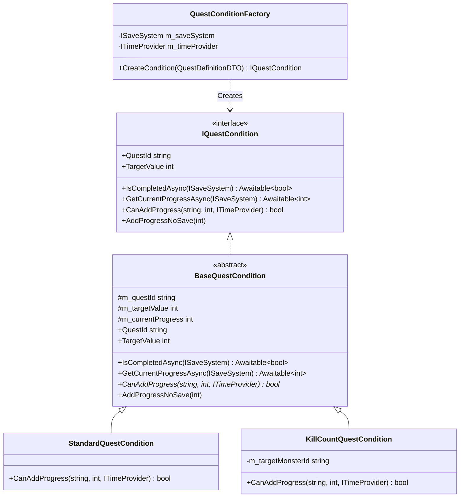
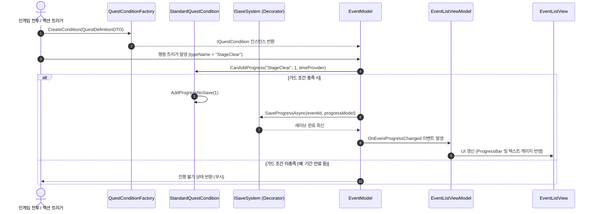

# 누적 행동 이벤트 시스템 설계서 (Action Accumulation Event System)

> **작성자**: 윤승종  
> **작성일**: 2026-06-16  

---

## 1. 개요
플레이어가 인게임에서 수행하는 특정 행동(적 처치, 스테이지 클리어, 광고 시청, 길드 미션 등)의 횟수를 누적하여, 사전에 정의된 목표 횟수에 도달하면 보상을 지급하는 이벤트 모델입니다.

---

## 2. 클래스 구조 및 책임 (Class Diagram)

누적 행동 이벤트는 인터페이스 `IQuestCondition`을 기반으로 설계되었으며, 기획 데이터만으로 동작하는 범용 조건과 특정 행동 데이터 수집에 종속된 특수 조건으로 분리됩니다.

### 2.1. 주요 클래스 정의
*   **`StandardQuestCondition`**
    *   누적 행동에 대한 구체적인 타겟팅 및 횟수 증가를 공통 처리하는 범용 조건 클래스입니다.
    *   C# 코드를 작성하지 않아도 기획자가 에디터 툴을 통해 SO 에셋 파일(`ConditionTypeSO`)만 추가하면 `QuestConditionFactory`가 C# 클래스의 부재를 감지하고 이 범용 클래스로 자동 폴백(Fallback) 처리하여 실행합니다.
*   **`KillCountQuestCondition`**
    *   특정 몬스터 ID 처치를 감지하여 처리해야 하는 복합 조건을 구현한 조건 클래스입니다.
*   **`BaseQuestCondition`**
    *   모든 조건 클래스의 공통 분모가 되는 추상 클래스로, 진행도 반환 및 완료 여부 판별의 보일러플레이트 로직(`IsCompletedAsync`, `GetCurrentProgressAsync`)을 구현하여 중복 코드를 최소화합니다.

---

## 3. 동작 흐름 (Data Flow)

인게임 행동이 감지되었을 때 상태를 검증하고 저장소에 영속화하며 UI를 갱신하기까지의 단방향 데이터 흐름 시퀀스입니다.

---

## 4. 확장성 및 OCP (Data-driven OCP)

*   **새로운 행동 누적 이벤트 추가 시 (예: 골드 소모 횟수, 로그인 횟수 등)**:
    1.  에디터 상단 메뉴 `Tools > BePex > 이벤트 시스템 확장 도구`를 엽니다.
    2.  확장할 대상 조건 영문명과 한글명을 입력하고, **"C# 클래스 파일 추가 생성 여부" 토글을 꺼둔 상태**로 실행합니다.
    3.  C# 스크립트 추가 생성이나 재컴파일 없이, 생성된 SO 에셋과 JSON 데이터 테이블 바인딩만으로 즉각 인게임에 편입이 완료되어 개방-폐쇄 원칙(OCP)을 실현합니다.
*   **특수 제약이 필요한 조건 추가 시 (예: 일일 제한 킬 수 등)**:
    - 확장 도구에서 C# 클래스 자동 생성 옵션을 켜면 전용 전략 클래스(`SpecialQuestCondition` 등)가 생성되며, 개발자는 `CanAddProgress` 내부에 커스텀 가드 로직을 기재하여 연동할 수 있습니다.
