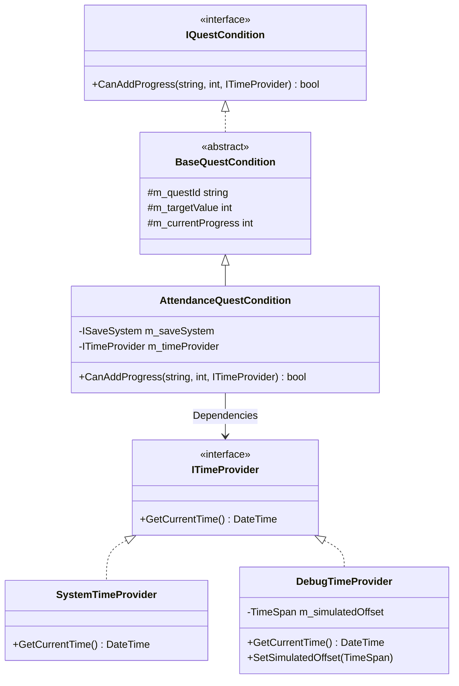
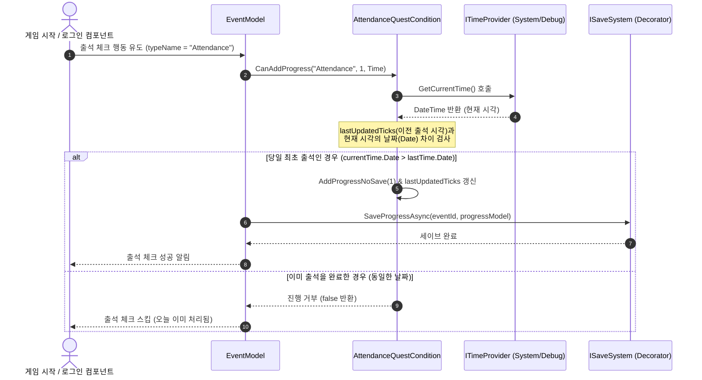

# 출석 이벤트 시스템 설계서 (Attendance Event System)

> **작성자**: 윤승종  
> **작성일**: 2026-06-16  

---

## 1. 개요
출석 이벤트 시스템은 사용자가 매일 접속할 때마다 보상을 제공하고, 일정 누적 일수를 채웠을 때 추가 보상을 제공하는 기능입니다.

---

## 2. 클래스 구조 및 책임 (Class Diagram)

출석 조건은 특정 시간에 묶인 동작을 수행하므로 `ITimeProvider`와 결합되며, 진행 이력 검증을 위해 `ISaveSystem`의 진척 데이터를 참조합니다.

### 2.1. 주요 클래스 정의
*   **`AttendanceQuestCondition`**
    *   사용자의 마지막 출석 시각을 추적하고, 하루 단위로 초기화되는 출석 체크 비즈니스 가드 로직을 처리합니다.
    *   `ITimeProvider`를 DI(의존성 주입) 받아 현재 시각을 조회하므로, 실제 시스템 시각 뿐만 아니라 테스트 및 가상 디버그 시간 조작 환경에서도 동일하게 작동합니다.
*   **`QuestProgressModel` (Model Data)**
    *   `currentProgress`: 현재 누적 출석 일수 데이터.
    *   `lastUpdatedTicks`: 마지막으로 출석 체크(가산)가 정상 처리된 시각의 Ticks 값.

---

## 3. 동작 흐름 (Data Flow)

접속 시 당일 출석이 유효한지 검사하고 진척도를 올린 뒤 데이터를 저장하는 흐름입니다.

---

## 4. 확장성 및 OCP

*   새로운 출석 유형(예: 연속 7일 보너스 출석, 월간 출석 등)을 추가할 시:
    *   `AttendanceQuestCondition` 자체를 수정하는 대신 새로운 `IQuestCondition` 구현체(`ConsecutiveAttendanceCondition` 등)를 정의하고 `[QuestCondition("이름")]` 어트리뷰트를 지정하면 팩토리가 런타임에 동적으로 매핑합니다.
    *   시간 검증 규칙과 데이터를 완벽하게 POCO 계층으로 설계하였으므로, 어떠한 유니티 생명주기 스크립트 수정도 없이 시간 비교 로직을 추가할 수 있습니다.
