# 설계 설명 및 회고 (Design Explanation & Retrospective)

> **작성자**: 윤승종  
> **작성일**: 2026-06-16  

---

## 1. 씬 구성 및 사용 이유 (Scenes & Purpose)

프로젝트는 역할이 격리된 두 개의 핵심 씬을 중심으로 구동되며, 각 씬은 철저한 역할 분리를 목표로 설계되었습니다.

*   **어드민 씬 (Admin Scene)**
    *   **역할**: 개발자나 기획자가 런타임 환경에서 이벤트 테이블을 안전하게 생성, 수정, 삭제(CRUD)하고 관리하는 에디팅 콘솔 씬입니다.
    *   **사용 이유**: 라이브 서버에 직접 데이터를 변경하기 전에 비정상 입력값(예: 공백 제목 등)에 대한 **무결성 검증 가드**를 수행하고, 로컬 디스크에 백업을 먼저 보장하는 **로컬 자동 저장 파이프라인**을 실행합니다. 검증이 완료된 데이터 테이블에 한해 Firebase REST API로 실시간 업로드 배포함으로써 휴먼 에러로 인한 라이브 배포 사고를 원천 방지합니다.
*   **인게임 씬 (In-game Scene)**
    *   **역할**: 실제 플레이어가 퀘스트를 완료하고 보상을 획득하는 본연의 콘텐츠가 구동되는 씬입니다.
    *   **사용 이유**: 플레이어의 실시간 콘텐츠 진행 사항(출석 체크, 적 처치 수, 스테이지 클리어)을 탐지하여 `IQuestCondition` 검증을 거치고, 최종 달성 시 보상을 `PlayerRewardModel` 딕셔너리에 실시간으로 가산 적립합니다. 모든 자산 변화와 퀘스트 진척도는 로컬 파일 I/O 시스템(`JsonSaveSystem`)을 통해 안정적으로 영속화됩니다.

---

## 2. 설계하면서 고려한 점 (Design Considerations & Key Decisions)

프로젝트 아키텍처를 설계하고 구현하는 과정에서 특히 다음의 핵심 가치들을 달성하는 데 주안점을 두었습니다.

### 2.1. OCP 극대화를 위한 Dictionary 기반 PlayerRewardModel 설계
*   **고려 사항**: 기존 코드에는 `m_totalExp`, `m_totalTickets` 등과 같이 하드코딩된 재화 변수들과 switch 분기문이 존재하여 신규 보상 재화가 추가될 때마다 코드를 수정하고 컴파일해야 하는 심각한 OCP 위반이 있었습니다.
*   **설계 결정**: 모든 재화 수량 변수를 제거하고 `Dictionary<string, int> m_currencies`로 재화 저장을 일원화했습니다.
*   **JsonUtility 직렬화 및 하위 호환성 해결**: Unity 내장 `JsonUtility`가 순수 딕셔너리를 직렬화하지 못하는 기술적 한계를 극복하기 위해 `ISerializationCallbackReceiver`를 구현하여 직렬화용 `List<CurrencyEntry>`와 동적 동기화되도록 설계했습니다. 또한, 기존 유저 세이브 데이터의 `m_totalExp` 등 레거시 JSON 변수들을 역직렬화 도중에 안전하게 흡수하는 `MigrateLegacyCurrency` 복구 로직을 구현하여 데이터 호환성 100%를 보장했습니다.

### 2.2. Type Object 패턴을 통한 이넘(Enum) 결합도 해소
*   **고려 사항**: 하드코딩된 이넘(`ConditionType`, `RewardType`)은 확장 시 코드 및 에디터 직렬화 정보를 훼손할 위험이 있었습니다.
*   **설계 결정**: 직렬화 데이터 에셋인 `ConditionTypeSO`/`RewardTypeSO` 및 전체 목록을 관리하는 `RegistrySO`를 활용하는 **Type Object 패턴**을 적용했습니다. 새로운 보상이나 조건 타입 추가 시, 코드를 고치고 에디터를 재빌드할 필요 없이 프로젝트 에셋 뷰에서 데이터 에셋 파일(`*.asset`)을 하나 생성하여 레지스트리에 링크해주는 것만으로 OCP 확장이 즉각적으로 완료됩니다.

### 2.3. Awaitable 기반의 Zero-Allocation 비동기 UI 연출
*   **고려 사항**: 기존의 `IEnumerator` 기반 코루틴은 매 프레임 프레임 지연 대기 시(`new WaitForEndOfFrame()`) 가비지(GC) 메모리 할당을 대량으로 유발하고, 씬이 전환되거나 UI가 도중에 파괴될 때 비동기 오작동 예외를 처리하기 어려웠습니다.
*   **설계 결정**: Unity 6 표준인 `Awaitable` 기법을 전면 적용하고 `CancellationToken`을 적극 도입했습니다. UI 생명주기(`OnDestroy`)와 완벽히 연동시켜 중복 호출이나 씬 전환 시 비동기 연출을 즉각 취소(Cancel)하도록 제어하여 안정성을 극대화하고 가비지 없는 쾌적한 런타임을 제공합니다.

---

## 3. 현재 구조의 한계와 개선 방향 (Limitations & Future Improvements)

클린 아키텍처에 근접한 설계를 이루어냈으나, 향후 상용 릴리즈 규모 확장에 대비해 다음과 같은 개선이 필요합니다.

*   **씬 전환 시 의존성(상태 데이터) 전달의 한계 (Pure DI의 한계)**
    *   **현재**: 싱글톤을 철저하게 배제하기 위해 각 씬의 `SceneInitializer` 및 DTO 주입 구조를 통한 Pure DI(수동 생성자 주입) 방식으로 각 씬 컨텍스트를 구성하고 있습니다. 이로 인해 씬 간 전역 데이터(유저 재화, 환경 설정 등)를 넘겨주기 위한 생성자 매개변수와 컴포지션 루트의 보일러플레이트 코드가 증가합니다.
    *   **개선 방향**: 씬을 넘나들며 독립적이면서도 동일한 생명주기를 유지해야 하는 최상위 데이터 컨테이너를 위해 VContainer와 같은 정식 DI 라이브러리 도입을 검토해야 합니다. `ProjectLifetimeScope` (글로벌 컨텍스트)를 명시적으로 분리 선언하여 글로벌 의존성을 최상단에서 한 번만 바인딩하고, 각 씬에 자동으로 전파되도록 구성해야 설계 피로도를 줄일 수 있습니다.
*   **동적 번들(Addressables)의 비동기 로딩 지연**
    *   **현재**: UI가 활성화되는 시점(`View.Start` 등)에서 아이콘이나 특정 프리팹을 어드레서블 런타임 로드로 가져오므로, 렌더링 시 1~2 프레임의 비동기 팝인(Pop-in) 현상이 발생하여 UX가 다소 어색해질 수 있습니다.
    *   **개선 방향**: 씬 진입 전 로딩 화면 페이즈(Loading Phase)를 구축하여, 해당 씬에 필요한 주요 어드레서블 에셋 목록을 사전 로드(Pre-load)하고 메모리에 상주시키는 리소스 매니저 레이어를 추가함으로써 부드러운 UX를 구현해야 합니다.
*   **리플렉션 팩토리의 초기화 오버헤드**
    *   **현재**: 앱 초기 구동 시 어셈블리 내의 전체 타입을 스캔하여 어트리뷰트(`[QuestCondition]`, `[QuestReward]`)가 붙은 타입들을 딕셔너리에 매핑하는 리플렉션 스캔 방식이 존재합니다.
    *   **개선 방향**: 모바일 기기에서의 구동 성능과 메모리를 최적화하기 위해, 런타임 리플렉션 대신 C# **Source Generator** 기능을 도입하여 컴파일 타임에 팩토리 등록 코드가 자동으로 구체화되어 생성되도록 만들면 초기 구동 시간을 획기적으로 낮출 수 있습니다.

---

## 4. 핵심 시스템 클래스 다이어그램 (Core Architecture Class Diagram)

아래 다이어그램은 리팩토링된 **View - ViewModel - Model**의 단방향 데이터 흐름과 **Type Object - Dictionary OCP** 및 **Factory - Strategy** 패턴이 통합된 프로젝트의 최종 결합 구조를 표현합니다.

```mermaid
classDiagram
    %% View Layer
    class EventListView {
        -m_viewModel: EventListViewModel
        +Bind()
    }
    class EventDetailView {
        -m_viewModel: EventDetailViewModel
        +func_OnReceiveRewardClicked()
    }
    class EventDebugView {
        -m_viewModel: EventDebugViewModel
        -m_slideCts: CancellationTokenSource
        +func_TogglePanel()
        -func_AnimatePanelAsync(Vector2, CancellationToken) Awaitable
    }
    
    %% ViewModel Layer
    class EventListViewModel {
        +EventList: List"EventDetailViewModel"
        +LoadEvents()
    }
    class EventDetailViewModel {
        +ProgressState
        +ReceiveRewardCommand()
    }
    class EventDebugViewModel {
        -m_playerReward: PlayerRewardModel
        +GetRewardStatus() Dictionary
        +SimulateActionAsync(string) Awaitable
    }
    
    %% Model Layer (Dictionary OCP & Serialization Callback)
    class PlayerRewardModel {
        -m_claimedEventIds: List"string"
        -m_currenciesList: List"CurrencyEntry"
        -m_currencies: Dictionary"string, int"
        +OnBeforeSerialize()
        +OnAfterDeserialize()
        +AddCurrency(string, int)
        +TrySpendCurrency(string, int) bool
        +GetBalances() Dictionary
        -NormalizeCurrencyKey(string) string
        -MigrateLegacyCurrency(string, ref int)
    }
    
    class EventProgressModel {
        +eventId: string
        +quests: List"QuestProgressModel"
    }
    class QuestProgressModel {
        +questId: string
        +currentProgress: int
        +isCompleted: bool
        +isRewardClaimed: bool
        +lastUpdatedTicks: long
    }
    
    %% Strategy & Registry & Factory (Core Logic)
    class QuestConditionFactory {
        -m_conditionTypeMap: Dictionary"string, Type"
        +CreateCondition(ConditionDefinitionSO, string, string) IQuestCondition
    }
    class QuestRewardFactory {
        -m_rewardTypeMap: Dictionary"string, Type"
        +CreateReward(RewardDefinitionSO) IQuestReward
    }
    
    class ConditionTypeRegistrySO {
        +ConditionTypes: List"ConditionTypeSO"
    }
    class RewardTypeRegistrySO {
        +RewardTypes: List"RewardTypeSO"
    }
    
    class IQuestCondition {
        <<interface>>
        +GetCurrentProgressAsync() Awaitable
        +IsCompletedAsync() Awaitable
        +CanAddProgress() bool
    }
    class IQuestReward {
        <<interface>>
        +Grant(PlayerRewardModel playerReward)
    }

    %% Relationships (Dependencies & Data Flow)
    EventListView --> EventListViewModel : Observe & Command
    EventDetailView --> EventDetailViewModel : Observe & Command
    EventDebugView --> EventDebugViewModel : Observe & Command
    
    EventListViewModel --> EventDebugViewModel : Connects
    EventDetailViewModel --> EventProgressModel : Binds State
    EventDebugViewModel --> PlayerRewardModel : Direct Access
    
    EventProgressModel *-- QuestProgressModel : Contains
    
    QuestConditionFactory ..> IQuestCondition : Creates (Reflection Map)
    QuestRewardFactory ..> IQuestReward : Creates (Reflection Map)
    
    QuestConditionFactory ..> ConditionTypeRegistrySO : Inspects
    QuestRewardFactory ..> RewardTypeRegistrySO : Inspects
    
    IQuestCondition --> QuestProgressModel : Evaluates & Updates
    IQuestReward ..> PlayerRewardModel : Invokes AddCurrency
```

