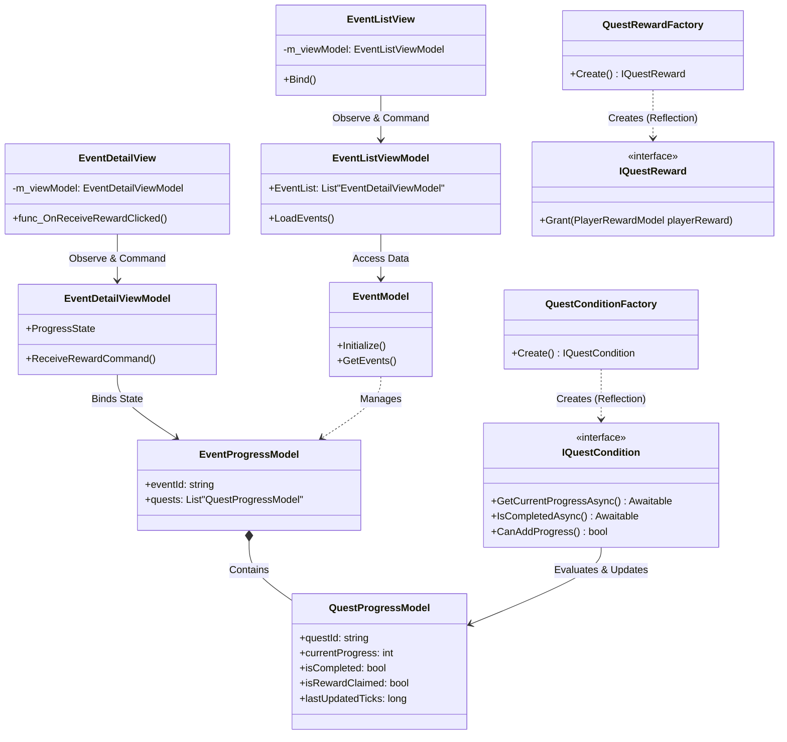

# 설계 설명 및 회고 (Design Explanation & Retrospective)

> **작성자**: 윤승종  
> **작성일**: 2026-06-16  

---

## 1. 설계하면서 고려한 점 (Design Considerations)

프로젝트 아키텍처를 설계하고 구현하는 과정에서 특히 다음의 핵심 가치들을 달성하는 데 주안점을 두었습니다.

*   **확장성 (Extensibility) 및 OCP 준수**
    *   새로운 종류의 이벤트나 보상이 추가될 때마다 핵심 분기 로직(If/Switch 문)이 수정되는 것을 방지하기 위해 `IQuestCondition`과 `IQuestReward` 인터페이스를 설계했습니다.
    *   `QuestConditionFactory` 및 `QuestRewardFactory`는 리플렉션(`Reflection`) 메커니즘을 이용해 `[QuestCondition]`, `[QuestReward]` 어트리뷰트가 붙은 클래스들을 런타임에 자동 수집합니다. 이를 통해 새로운 클래스 파일 하나를 추가하는 것만으로 시스템 편입이 완결되는 개방-폐쇄 원칙을 확립했습니다.
*   **책임 분리 (SoC, Separation of Concerns) 및 MVVM 분리**
    *   `MonoBehaviour`가 가진 한계와 결합도를 낮추기 위해 View는 오직 화면을 렌더링하고 유저 입력을 받는 역할만 수행합니다.
    *   내부적인 비즈니스 로직, 상태 판별, 이벤트 달성 여부 등은 철저히 ViewModel과 Model(순수 C# 객체)에 위임하여 의존성을 단방향으로 통제했습니다.
*   **데이터와 로직의 분리 (POCO 구조)**
    *   진행 상황을 저장하는 `EventProgressModel` 및 `QuestProgressModel` 등의 클래스 내부에는 Unity API(`UnityEngine`) 참조를 일절 포함하지 않았습니다.
    *   순수 데이터 객체와 이를 조작하는 로직 객체(Strategy)를 분리함으로써, 추후 씬(Scene) 독립적인 유닛 테스트 작성이 매우 용이해졌습니다.
*   **서버 연동을 고려한 유연성 설계**
    *   데이터 직렬화 및 저장을 담당하는 계층을 추상화(`ISaveSystem`)하여 현재는 로컬 JSON 저장소(`JsonSaveSystem`)를 사용하지만, 추후 Firebase, PlayFab 등 라이브 서버 DB 연동 코드로 손쉽게 갈아끼울 수 있는 기반을 마련했습니다.

---

## 2. 현재 구조의 한계와 개선 방향 (Limitations & Future Improvements)

클린 아키텍처에 근접한 설계를 이루어냈으나, 향후 상용 릴리즈 규모 확장에 대비해 다음과 같은 개선이 필요합니다.

*   **씬 전환 시 의존성(상태 데이터) 전달의 한계**
    *   **현재**: 싱글톤을 배제하기 위해 각 씬의 `LifetimeScope`에서 DTO를 기반으로 필요한 의존성만 재조립하고 있습니다. 이로 인해 씬 간 전역 데이터(유저 재화, 환경 설정 등)를 넘겨주는 보일러플레이트 코드가 증가합니다.
    *   **개선 방향**: 씬을 넘나들며 유지되어야 하는 최상위 데이터 컨테이너를 위해 `ProjectLifetimeScope` (또는 `RootScope`)를 명시적으로 분리 선언하여 글로벌 의존성을 최상단에서 한 번만 주입하는 방식으로 다듬어야 합니다.
*   **동적 번들(Addressables)의 비동기 로딩 지연**
    *   **현재**: UI가 활성화되는 시점(`View.Start` 등)에서 아이콘이나 특정 프리팹을 어드레서블 런타임 로드로 가져오므로, 렌더링 시 1~2 프레임의 비동기 팝인(Pop-in) 현상이 발생할 수 있습니다.
    *   **개선 방향**: 인게임이나 로비 씬 진입 전 로딩 화면 페이즈(Loading Phase)를 구축하여, 해당 씬에 필요한 주요 어드레서블 에셋 목록을 사전 캐싱(Pre-load)하는 리소스 매니저 레이어를 추가해야 부드러운 UX가 완성됩니다.
*   **리플렉션 팩토리의 초기화 오버헤드**
    *   **현재**: 앱 초기 구동 및 `LifetimeScope` 빌드 시 어셈블리 내의 전체 타입을 스캔하여 어트리뷰트를 매핑하는 리플렉션 로직이 존재합니다.
    *   **개선 방향**: 모바일 기기에서의 성능과 배터리를 최적화하기 위해 리플렉션 대신 **Source Generator** 기능을 도입하여 컴파일 타임에 팩토리 등록 코드를 자동 생성하게 만들면 초기 구동 시간을 획기적으로 줄일 수 있습니다.

---

## 3. 핵심 시스템 클래스 다이어그램 (Core Architecture Class Diagram)

아래 다이어그램은 **View - ViewModel - Model**의 단방향 데이터 흐름과 **Factory - Strategy(Condition/Reward)** 패턴이 결합된 프로젝트의 전반적인 구조를 시각화한 것입니다.

