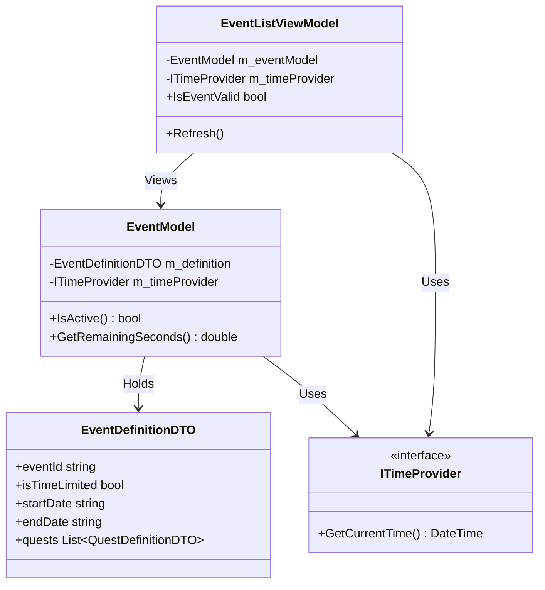
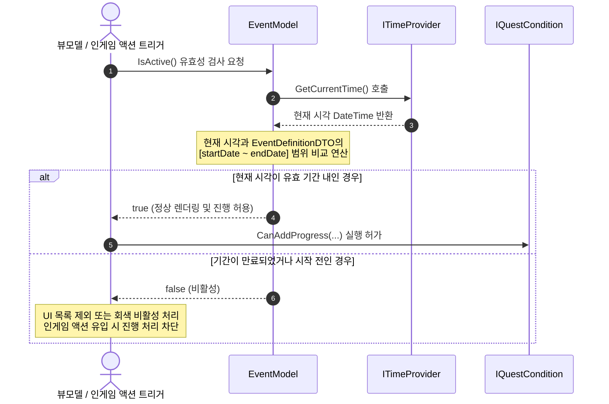

# 기간 이벤트 시스템 설계서 (Period Event System)

> **작성자**: 윤승종  
> **작성일**: 2026-06-16  

---

## 1. 개요
이벤트의 활성화 및 동작 여부가 특정 날짜 및 시간 범위(Start Date ~ End Date) 내에 결합되어 있는 시스템입니다. 이벤트 기간이 만료되면 더 이상 진척도를 올릴 수 없고 보상 획득도 제한됩니다.

---

## 2. 클래스 구조 및 유효성 판단 (Class Diagram)

기간 제약은 이벤트 단위로 적용되며, 하위의 개별 퀘스트(Quest) 조건들은 이벤트의 활성화 상태에 동속되어 검증을 받습니다.

### 2.1. 주요 데이터 및 필드 정의
*   **`EventDefinitionDTO` (Model Data)**
    *   `isTimeLimited`: 기간 제한 적용 여부 플래그.
    *   `startDate`: 이벤트 시작 시각 문자열 (ISO 8601 포맷: `YYYY-MM-DD HH:mm:ss`).
    *   `endDate`: 이벤트 종료 시각 문자열.
*   **`EventModel` (Business Logic)**
    *   `IsActive()`: 현재 시각이 `startDate`와 `endDate` 사이에 있는지 여부를 리턴합니다. `isTimeLimited`가 `false`인 영구 이벤트는 항상 `true`를 반환합니다.
    *   시간 파싱 비용을 최소화하기 위해 내부 Nullable 필드에 파싱 완료된 `DateTime`을 캐싱하여 관리합니다.

---

## 3. 동작 흐름 (Data Flow)

이벤트 만료를 확인하고 리스트 렌더링에 반영하며 진행도를 차단하는 단방향 흐름입니다.

### 3.1. 시간 조작 시뮬레이션 (Debug Flow)
*   어드민 씬 및 디버그 UI 상에서 `DebugTimeProvider`를 사용해 강제로 타임 오프셋을 더하거나 뺄 수 있습니다.
*   타임 오프셋이 설정되면 `EventListViewModel.Refresh()`가 호출되며, 모든 이벤트의 `IsActive()` 조건이 즉각 재연산되어 유효 기간 만료 화면이 즉시 렌더링에 반영됩니다.

---

## 4. 확장성 및 계층형 구조 (Hierarchy)

*   **상속 구조 간소화**: 
    *   기간(Period) 유효성 데이터는 최상위인 **이벤트(Event)** 계층이 독점하여 캡슐화 처리합니다.
    *   하위의 개별 **퀘스트(Quest)**들은 상위 이벤트의 활성 여부(`EventModel.IsActive()`)를 그대로 조회하므로, 개별 퀘스트 마다 시작/종료 일시를 중복 저장하여 검사하는 번거로움과 데이터 오버헤드를 막습니다.
    *   향후 특정 퀘스트만 단독 만료되는 예외 구조가 추가되더라도, `QuestDefinitionDTO` 내부에 개별 기간 플래그를 편입하여 `IQuestCondition.CanAddProgress` 내에서 다형적으로 체크하면 쉽게 대응이 가능합니다.
