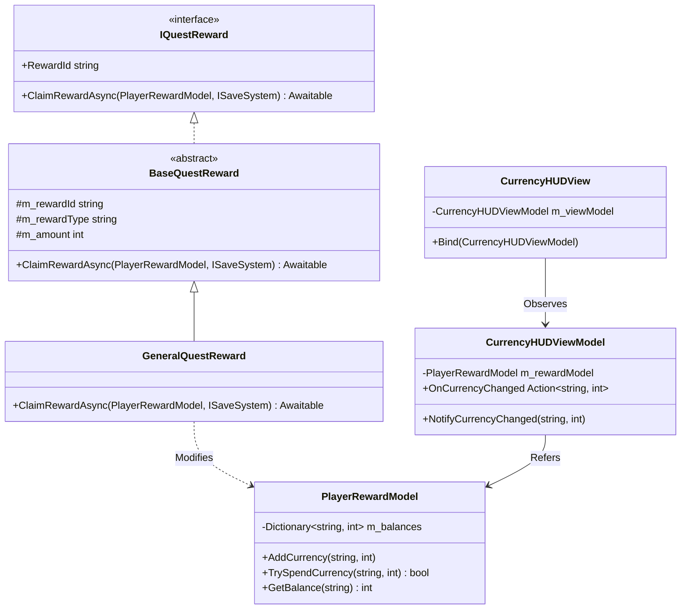
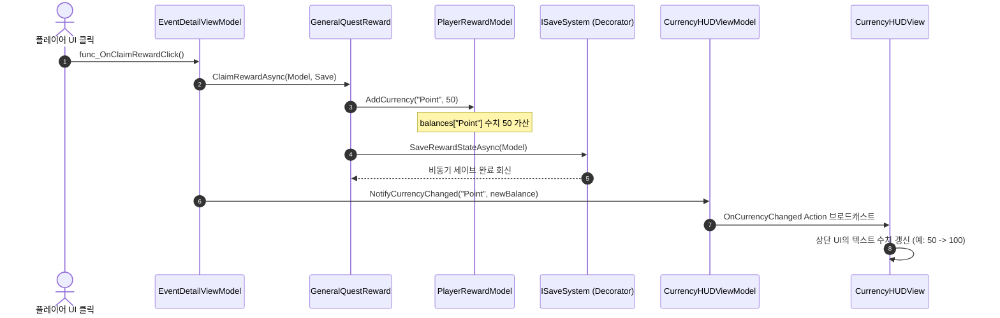

# 이벤트 포인트 시스템 설계서 (Event Point System)

> **작성자**: 윤승종  
> **작성일**: 2026-06-16  

---

## 1. 개요
조건 달성 시 정해진 인게임 아이템을 일방적으로 수령하는 직관적인 수령 모델을 넘어, 특정 보상(이벤트 포인트, 시즌 포인트, 크레딧 등)을 지급하여 사용자가 이 재화를 적립한 뒤, 원하는 가치의 상점 상품이나 다른 보상 세트로 직접 교환할 수 있도록 제공하는 게임 내 화폐 경제 시스템입니다.

---

## 2. 클래스 구조 및 책임 (Class Diagram)

재화는 `PlayerRewardModel`에서 통합 관리되며, 보상 객체(`GeneralQuestReward`)에 의해 가산됩니다. 재화 변동 시 UI는 뷰모델(`CurrencyHUDViewModel`)을 통해 단방향으로 자동 갱신됩니다.

### 2.1. 주요 클래스 정의
*   **`PlayerRewardModel`**
    *   유저가 보유한 모든 재화(Point, SeasonPoint, Credit 등)의 잔액을 캡슐화 관리하는 순수 C# 도메인 모델(POCO)입니다.
    *   데이터의 증가(`AddCurrency`) 및 차감(`TrySpendCurrency`)의 무결성 검증을 책임집니다.
*   **`GeneralQuestReward`**
    *   보상 수령 명령이 실행될 때 `PlayerRewardModel`에 접근하여, 지정된 재화 코드와 수량만큼 화폐를 더해주는 보상 전략 구현체입니다.
*   **`CurrencyHUDViewModel`**
    *   보유 화폐 데이터가 변경되었음을 브로드캐스팅하는 이벤트 핸들러(`NotifyCurrencyChanged`)를 제공하며, 상단 재화 HUD UI 갱신을 주도합니다.

---

## 3. 동작 흐름 (Data Flow)

보상을 수령하여 포인트 재화 잔액이 올라가고 상단 재화 표시가 변경되는 일련의 데이터 흐름입니다.

---

## 4. 확장성 및 OCP

*   **새로운 화폐 타입 추가 시 (예: 길드 코인, 다이아 등)**:
    *   데이터 테이블(JSON)의 보상 정적 정의 파트에서 화폐 식별 문자열(예: `"GuildCoin"`)로 지정하기만 하면 됩니다.
    *   `PlayerRewardModel`은 내부적으로 `string`-`int` 딕셔너리로 잔액을 관리하므로 C# 코드 추가나 스키마 수정 없이도 새로운 포인트 체계를 즉시 누적 및 차감하여 활용할 수 있습니다.
    *   UI 상단 HUD에 추가된 화폐를 바인딩하고 싶을 경우, `CurrencyHUDView`에서 갱신을 원하는 화폐 식별자를 바인딩하고 `NotifyCurrencyChanged`에 체이닝해주는 것으로 코드 변화를 최소화할 수 있습니다.
