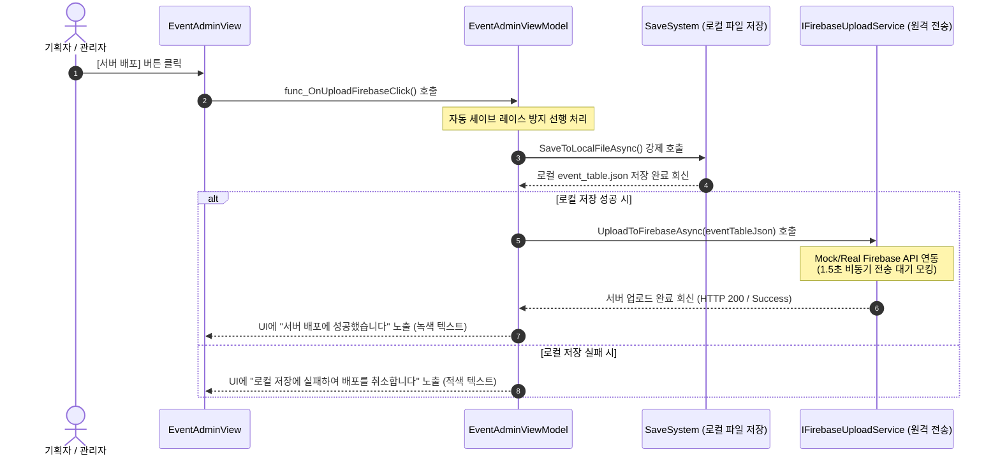

# 데이터 persist 및 세이브 시스템 설계서 (Data Persistence & Save System)

> **작성자**: 윤승종  
> **작성일**: 2026-06-16  

## 1. 개요
플레이어의 이벤트 달성 진행 상황(`EventProgressModel`) 및 보유 재화 잔액(`PlayerRewardModel`) 데이터를 로컬 디스크 파일에 영속화(Persist)하고, 모바일 기기의 파일 I/O 부하 및 GC 발생을 최소화하기 위한 캐싱 최적화 레이어가 포함된 데이터 Persistence 시스템입니다.

---

## 2. 주요 클래스 및 책임

### 2.1. 세이브 시스템 클래스 구조 (Class Diagram)

데코레이터 패턴을 적용하여 캐싱, 예외 재시도, 원격 DB 연동, 트랜잭션 안전성 관심사를 물리 파일 입출력 로직과 완벽히 격리하였습니다.

```mermaid
classDiagram
    class ISaveSystem {
        <<interface>>
        +LoadProgressAsync(string, CancellationToken) Awaitable~EventProgressModel~
        +SaveProgressAsync(string, EventProgressModel, CancellationToken) Awaitable
        +LoadRewardStateAsync(CancellationToken) Awaitable~PlayerRewardModel~
        +SaveRewardStateAsync(PlayerRewardModel, CancellationToken) Awaitable
        +ClearAllSaveDataAsync(CancellationToken) Awaitable
    }

    class JsonSaveSystem {
        -string m_saveDir
        +LoadProgressAsync(string, CancellationToken) Awaitable~EventProgressModel~
        +SaveProgressAsync(string, EventProgressModel, CancellationToken) Awaitable
    }

    class InMemorySaveSystem {
        -Dictionary~string, string~ m_virtualDisk
        +LoadProgressAsync(string, CancellationToken) Awaitable~EventProgressModel~
        +SaveProgressAsync(string, EventProgressModel, CancellationToken) Awaitable
    }

    class CachedSaveSystem {
        -ISaveSystem m_innerSaveSystem
        -Dictionary~string, EventProgressModel~ m_cachedProgress
        -PlayerRewardModel m_cachedReward
        -HashSet~string~ m_dirtyIds
        +LoadProgressAsync(string, CancellationToken) Awaitable~EventProgressModel~
        +SaveProgressAsync(string, EventProgressModel, CancellationToken) Awaitable
    }

    class RetrySaveSystemDecorator {
        -ISaveSystem m_innerSaveSystem
        -int m_maxRetryCount
        -float m_baseDelaySeconds
        +SaveProgressAsync(string, EventProgressModel, CancellationToken) Awaitable
    }

    class TransactionalSaveSystemDecorator {
        -ISaveSystem m_innerSaveSystem
        +SaveProgressAsync(string, EventProgressModel, CancellationToken) Awaitable
    }

    ISaveSystem <|.. JsonSaveSystem
    ISaveSystem <|.. InMemorySaveSystem
    ISaveSystem <|.. CachedSaveSystem
    ISaveSystem <|.. RetrySaveSystemDecorator
    ISaveSystem <|.. TransactionalSaveSystemDecorator

    CachedSaveSystem o--> ISaveSystem : Wraps
    RetrySaveSystemDecorator o--> ISaveSystem : Wraps
    TransactionalSaveSystemDecorator o--> ISaveSystem : Wraps
```



### 2.2. 클래스 역할 요약
*   **`ISaveSystem` (Interface)**
    *   이벤트 진행 상태 및 재화 데이터의 세이브/로드/초기화를 수행하기 위한 입출력 추상화 규격입니다.
*   **`JsonSaveSystem` (Infrastructure)**
    *   유니티의 `Application.persistentDataPath` 디렉토리를 샌드박스 저장 위치로 삼아, 데이터를 JSON 텍스트 파일 형식으로 로컬 디바이스 디스크에 물리적으로 읽고 쓰는 파일 I/O 구체 클래스입니다.
*   **`CachedSaveSystem` (Decorator 최적화)**
    *   `ISaveSystem`을 구현하는 **데코레이터(Decorator) 패턴** 클래스입니다.
    *   동일한 세이브 데이터에 대해 매번 디스크 물리 쓰기/읽기를 유발하는 병목을 방지하기 위해 내부적으로 `Dictionary` 캐시 장치를 둡니다.
    *   데이터 조회 시 캐시된 데이터를 우선 반환하고, 저장 시에는 메모리 캐시를 즉시 갱신한 후 필요할 때만 비동기로 내부 `JsonSaveSystem`을 호출하여 디스크에 기록(Flush)합니다.
*   **`InMemorySaveSystem` (Test Double)**
    *   디바이스 물리 I/O 없이 메모리 상의 `Dictionary`로만 데이터의 라이프사이클을 가상 유지하는 테스트 전용 대역 객체(Mock/Fake)입니다. 씬과 파일 독립적인 고속의 단위 테스트(EditMode)를 실행하는 데 활용됩니다.
*   **`CloudSaveSystem` (확장 대비)**
    *   추후 원격 데이터베이스 또는 클라우드 서버 세이브 동기화 기능(예: Firebase Database, PlayFab 등)을 제공하기 위해 추상 설계된 구조체입니다.
*   **`RetrySaveSystemDecorator` (Decorator 재시도 안전성)**
    *   `ISaveSystem`을 구현하는 **데코레이터(Decorator) 패턴** 클래스입니다.
    *   로컬/원격 저장 실패에 대비하여, 비동기 입출력 작업 실패 시 지수 백오프(Exponential Backoff) 알고리즘을 사용해 최대 3회 재시도를 보장하며 저장 안정성을 극대화합니다.

---

## 3. 저장 위치 및 파일명 규칙

시스템은 유저 데이터 유실을 방지하고 유니티 샌드박스 표준 정책을 준수하기 위해 `Application.persistentDataPath` 경로 내에 다음 파일명들로 데이터를 분할 저장합니다:

| 데이터 분류 | 대상 데이터 객체 | 로컬 물리 파일명 규칙 |
| :--- | :--- | :--- |
| **이벤트 진행도** | `EventProgressModel` | `{Application.persistentDataPath}/event_progress_{eventId}.json` |
| **보상 재화 정보** | `PlayerRewardModel` | `{Application.persistentDataPath}/player_reward.json` |

*   *예시 (Windows/macOS)*: 
    *   macOS: `/Users/{UserName}/Library/Application Support/{Company}/{ProductName}/event_progress_event_001.json`
    *   Windows: `C:\Users\{UserName}\AppData\LocalLow\{Company}\{ProductName}\event_progress_event_001.json`

---

## 4. 저장 데이터 포맷 (JSON Schema)

### 4.1 이벤트 진행도 (`event_progress_event_001.json`)
각 이벤트 내 개별 퀘스트들의 진행 일수, 횟수, 그리고 최종 시간 정보는 다음과 같이 계층적 퀘스트 리스트 형식으로 저장됩니다.
```json
{
  "eventId": "event_001",
  "quests": [
    {
      "questId": "quest_01",
      "currentProgress": 3,
      "isCompleted": true,
      "isRewardClaimed": true,
      "lastUpdatedTicks": 638234859000000000
    },
    {
      "questId": "quest_02",
      "currentProgress": 10,
      "isCompleted": false,
      "isRewardClaimed": false,
      "lastUpdatedTicks": 638234859050000000
    }
  ]
}
```

### 4.2 플레이어 재화 및 보상 (`player_reward.json`)
골드, 포인트, 신용도 등 화폐 잔액 데이터는 JSON 직렬화 한계(유니티 내장 JsonUtility의 Dictionary 직렬화 미지원)를 우회하기 위해 `Key-Value` 형태의 리스트 구조로 평탄화되어 보관됩니다.
```json
{
  "m_balances": [
    {
      "Key": "Point",
      "Value": 120
    },
    {
      "Key": "SeasonPoint",
      "Value": 450
    },
    {
      "Key": "Credit",
      "Value": 25
    }
  ]
}
```

---

## 5. 세이브 / 로드 (Save / Load) 구현 방식과 방법

세이브와 로드는 메인 쓰레드 블로킹(렉 유발)을 최소화하기 위해 유니티 6.0의 **`Awaitable` 비동기 파일 입출력**을 기본으로 동작합니다.

### 5.1 저장 (Save) 방법
1.  객체 데이터를 직렬화용 JSON 텍스트 버퍼로 변환합니다 (`JsonUtility.ToJson`).
2.  디바이스 저장 디렉토리 존재 여부를 확인하고 없으면 신설합니다.
3.  `File.WriteAllTextAsync(path, json)`를 호출하여 비동기 스레드 풀에서 디스크 쓰기를 수행합니다.
```csharp
public async Awaitable SaveProgressAsync(string eventId, EventProgressModel progress, CancellationToken cancellationToken = default)
{
    string path = GetProgressPath(eventId);
    string json = JsonUtility.ToJson(progress, true);
    
    // 비동기 디스크 쓰기 실행 (취소 토큰 전파)
    await File.WriteAllTextAsync(path, json, cancellationToken);
}
```

### 5.2 불러오기 (Load) 방법
1.  저장 위치에 파일이 존재하는지 `File.Exists(path)`를 검사합니다.
2.  파일이 없는 경우 신규 유저로 판정하고 빈 데이터 모델(`new EventProgressModel()`)을 새로 생성하여 리턴합니다.
3.  파일이 존재할 경우 `File.ReadAllTextAsync(path)`를 실행해 비동기로 파일 스트림을 버퍼에 올린 뒤 `JsonUtility.FromJson<T>`을 활용하여 물리 객체 데이터로 역직렬화 복원합니다.
```csharp
public async Awaitable<EventProgressModel> LoadProgressAsync(string eventId, CancellationToken cancellationToken = default)
{
    string path = GetProgressPath(eventId);
    if (!File.Exists(path))
    {
        return new EventProgressModel { eventId = eventId, quests = new List<QuestProgressModel>() };
    }

    // 비동기 파일 읽기 실행 (취소 토큰 전파)
    string json = await File.ReadAllTextAsync(path, cancellationToken);
    return JsonUtility.FromJson<EventProgressModel>(json);
}
```

---

## 6. 서버 업로드 (Firebase 배포) 방식과 방법

관리자 프로그램(어드민 씬)에서 기획자가 전체 이벤트 정의 테이블 데이터를 가공/추가/수정한 뒤, Firebase 실시간 원격 데이터베이스로 전송하여 전 클라이언트에 공지 배포하는 파이프라인 흐름 명세입니다.

### 6.1 배포 흐름 시퀀스


### 6.2 업로드 구현 방법
- `IFirebaseUploadService.cs`를 매개로 업로드 인터페이스를 추상화하였으며, 현재는 모의 환경인 `MockFirebaseUploadService`가 바인딩되어 동작합니다.
- 실제 업로드 시에는 `HttpClient`를 활용하여 Firebase REST API 끝점(Endpoint)으로 `PUT` 혹은 `POST` 요청을 날리거나 Firebase SDK의 `SetRawJsonValueAsync`를 사용하여 리모트 JSON 저장소에 전체 갱신 데이터를 주입하는 방식을 취합니다.

---

## 7. 동작 흐름 (Data Flow)

```mermaid
sequenceDiagram
    autonumber
    actor Player as 뷰 / 이벤트 행동 트리거
    participant VM as EventDetailViewModel
    participant Cache as CachedSaveSystem
    participant Disk as JsonSaveSystem
    
    Player->>VM: 보상 받기 클릭 / 행동 시뮬레이션
    VM->>Cache: LoadProgressAsync(eventId) 요청
    
    alt 캐시에 데이터가 존재하는 경우
        Cache-->>VM: 메모리 캐시 데이터 즉시 반환
    else 캐시가 비어 있는 경우
        Cache->>Disk: LoadProgressAsync(eventId) 물리 파일 읽기 요청
        Disk->>Disk: persistentDataPath 내 파일 조회 및 JSON 파싱
        Disk-->>Cache: 복원된 EventProgressModel 전달
        Cache->>Cache: 메모리 캐시에 데이터 적재 (Caching)
        Cache-->>VM: 복원 데이터 반환
    end
    
    VM->>VM: 데이터 가산 및 완료 연산
    VM->>Cache: SaveProgressAsync(eventId, progress) 저장 하달
    Cache->>Cache: 메모리 캐시 데이터 실시간 동기화
    Cache->>Disk: SaveProgressAsync(eventId, progress) 비동기 파일 플러시 실행
    Disk->>Disk: JSON 직렬화 및 디스크 덮어쓰기 완료
    Disk-->>Cache: 쓰기 작업 완료
    Cache-->>VM: 세이브 성공 상태 반환

### 7.2 지수 백오프 비동기 재시도 흐름 (Retry Save Data Flow)
물리 파일 I/O 오류 또는 원격 서버 불안정성으로 인해 데이터 저장이 실패할 경우, `RetrySaveSystemDecorator`가 중간에서 예외를 캐치하여 지수 백오프(Exponential Backoff) 지연 간격으로 자동 재시도를 처리하는 흐름입니다.

```mermaid
sequenceDiagram
    autonumber
    participant Client as 뷰모델 / 클라이언트
    participant Retry as RetrySaveSystemDecorator
    participant Inner as innerSaveSystem (Cached / Json)

    Client->>Retry: SaveProgressAsync(eventId, progress, Token)
    Note over Retry: CancellationToken<br/>취소 가능 상태 검사
    
    Retry->>Inner: SaveProgressAsync() 물리 저장 요청 (1차)
    alt 1차 시도 실패 (Exception 발생)
        Inner-->>Retry: File I/O 에러 / 네트워크 에러 반환
        Note over Retry: 1차 실패 감지<br/>대기 지연 = baseDelay * 2^0 (1초)
        Retry->>Retry: Awaitable.WaitForSecondsAsync(1s)
        
        Retry->>Inner: SaveProgressAsync() 물리 저장 요청 (2차)
        alt 2차 시도 성공
            Inner-->>Retry: 저장 성공 회신
            Retry-->>Client: 저장 완료 전달
        else 2차 시도 실패 (Exception 발생)
            Inner-->>Retry: 에러 반환
            Note over Retry: 2차 실패 감지<br/>대기 지연 = baseDelay * 2^1 (2초)
            Retry->>Retry: Awaitable.WaitForSecondsAsync(2s)
            
            Retry->>Inner: SaveProgressAsync() 물리 저장 요청 (3차)
            alt 3차 시도 성공
                Inner-->>Retry: 저장 성공 회신
                Retry-->>Client: 저장 완료 전달
            else 최종 실패 (3차 시도 한도 초과)
                Inner-->>Retry: 에러 반환
                Note over Retry: Debug.LogError 기록 및 예외 전파
                Retry-->>Client: 최종 Exception Throw (저장 실패)
            end
        end
    else 1차 시도 즉시 성공
        Inner-->>Retry: 저장 성공 회신
        Retry-->>Client: 저장 완료 전달
    end
```
```

---

## 8. 최적화 및 확장성 (Decorator & OCP)

*   **데코레이터 패턴을 활용한 책임 분리**:
    *   캐싱(Caching) 및 성능 최적화 관심사는 `CachedSaveSystem`에, 단순 디스크 입출력(File System) 관심사는 `JsonSaveSystem`에 각각 완벽히 분리되어 있어 객체당 단일 책임(SRP)을 엄수합니다.
    *   기존 디스크 입출력 코드에 단 한 줄의 수정도 가하지 않고 최적화 기능을 유연하게 켜고 끌 수 있는 OCP(Open-Closed Principle) 구조를 보장합니다.
*   **다형성을 통한 백엔드 다원화**:
    *   컴포지션 루트(`EventSceneInitializer`)에서 DI 주입 시 `ISaveSystem` 인터페이스에 대해 `new RetrySaveSystemDecorator(new CachedSaveSystem(new JsonSaveSystem()))`을 주입하는 형태로 조립되어 에러 회복력과 캐싱을 동시에 얻습니다.
    *   추후 서버 SDK 연동이 필요할 시 `CloudSaveSystem` 또는 새로운 `ISaveSystem` 구현체 어댑터를 생성하여 주입 관계만 교체하면 클라이언트 전반의 세이브 아키텍처는 고스란히 재사용됩니다.

---

## 9. 어드레서블 에셋 시스템 (Addressables) 연동 및 대응 방법

클라이언트는 대용량 리소스 파일 크기를 절감하고 런타임 에셋을 유연하게 제어하기 위해 유니티의 **Addressable Asset System**을 활용하여 데이터 및 스프라이트를 비동기식으로 가져옵니다.

### 9.1 공용 이벤트 정의 테이블 (JSON) 비동기 로딩
*   `EventSceneInitializer` 및 `EventAdminSceneInitializer` 씬 초기화(컴포지션 루트) 시점에 에디터 배포 대상인 `event_table.json`을 물리 디렉토리 경로가 아닌 어드레서블 주소 키(`m_eventJsonAddress`)로 로드합니다.
*   `Addressables.LoadAssetAsync<TextAsset>`의 비동기 핸들을 생성하여 로딩이 완료될 때까지 비동기(`await`) 대기한 후 텍스트 버퍼 데이터를 파싱합니다.
```csharp
private async Awaitable LoadEventTableAddressableAsync()
{
    var handle = Addressables.LoadAssetAsync<TextAsset>(m_eventJsonAddress);
    TextAsset textAsset = await handle.Task;
    
    if (handle.Status == UnityEngine.ResourceManagement.AsyncOperations.AsyncOperationStatus.Succeeded)
    {
        string json = textAsset.text;
        // DTO 역직렬화 진행
    }
}
```

### 9.2 OCP 기반 보상 스프라이트 아이콘 동적 매핑
*   `ItemSpriteMapper`는 포인트, 크레딧, 입장 티켓 등의 보상이 추가되더라도 기존 코드를 변경하지 않는 OCP 전략 구조를 유지합니다.
*   보상 타입(`RewardType`)에 맞춰 사전에 설정된 어드레서블 스프라이트 주소 키(`addressKey`)를 추출하여 `Addressables.LoadAssetAsync<Sprite>(addressKey)`를 호출해 이미지를 메모리에 비동기 로드 및 캐싱하고 이를 즉각 UI 이미지 컴포넌트에 바인딩합니다.

### 9.3 UI 셀 에셋 라이프사이클 관리 및 메모리 락 해제
*   비동기로 로드된 어드레서블 에셋들은 유니티 엔진 상에서 명시적으로 릴리즈해주지 않으면 메모리 상에 참조 락이 걸려 해제되지 않는 **메모리 누수(Memory Leak)**의 원인이 됩니다.
*   `EventItemCell` 내에서 개별 아이콘이나 배경을 동적 로드 시 로딩 핸들(`m_spriteLoadHandle`)을 캐싱해두고, 해당 UI 셀 오브젝트가 비활성화되거나 씬 전환으로 소멸되는 `OnDestroy()` 라이프사이클 호출 시점에 반드시 **`Addressables.Release(m_spriteLoadHandle)`**를 실행하여 연동 리소스를 물리적으로 안전하게 반환합니다.
```csharp
private void OnDestroy()
{
    // 로드되었던 어드레서블 스프라이트 리소스의 참조 락 해제
    if (m_spriteLoadHandle.IsValid())
    {
        Addressables.Release(m_spriteLoadHandle);
    }
}
```
