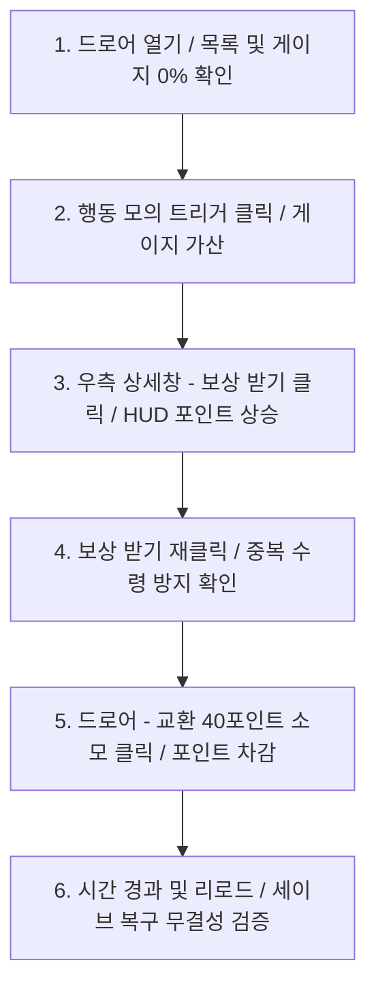

# 9대 필수 기능 수동 검증용 테스트 환경 조작 가이드

이 문서는 BePex Unity Client 프로젝트의 9대 핵심 이벤트 기능이 인게임 플레이 환경과 디버그 패널을 통해 유기적으로 동작하는지 기획자 및 QA가 수동으로 완벽히 검증할 수 있도록 돕는 조작 가이드라인입니다.

---

## 1. 테스트 환경 개요 및 진입

- **대상 씬**: `Assets/_Game/Scenes/MainGame.unity` (또는 프로젝트 내 설정된 이벤트 데모 씬)
- **테스트 환경 특징**:
  - 프로덕션 코드와 디버그 계층이 안전하게 비결합(Decoupling)되어 있습니다.
  - 디렉터리 내 세이브 파일 훼손을 방지하기 위해 플레이모드 실행 시 메모리 기반 저장 장치(`InMemorySaveSystem`)가 임시로 주입되거나 안전한 샌드박스 영역에 저장됩니다.

---

## 2. 디버그 UI 레이아웃 및 드로어 조작

드로어 패널은 모바일 및 다양한 기기 해상도에 대응하기 위해 **450px 고정 너비**와 그리드 레이아웃 오버랩 방지 기술을 채택하고 있습니다.

1. **드로어 토글**:
   - 화면 좌측 가장자리에 위치한 **`>` 버튼**을 클릭하면 디버그 조작 드로어 패널이 부드러운 슬라이딩 애니메이션과 함께 왼쪽에서 오른쪽으로 열립니다.
   - 드로어가 완전히 열리면 토글 버튼의 화살표 기호가 **`<`** 로 전환되며, 다시 클릭하면 화면 밖으로 안전하게 수납됩니다.
2. **반응형 스크롤**:
   - 해상도 축소로 공간이 좁아지는 현상(Squish)을 원천 방지하기 위해 세로 스크롤 영역(`ContentSizeFitter` 및 `FlexibleHeight` 활용)을 제공하므로, 화면 스크롤을 드래그하여 숨겨진 조작 인터페이스를 원활히 탐색할 수 있습니다.

---

## 3. 9대 핵심 기능 단계별 수동 검증 가이드

아래 지침에 따라 1단계부터 6단계까지 순서대로 조작하면서 인게임의 변화를 육안으로 확인해 주십시오.

### 1단계: 이벤트 목록 표시 및 진행도 표시 검증
- **조작**: 게임 실행 후 좌측 드로어 패널을 열고, 중앙의 이벤트 리스트 패널과 우측의 이벤트 상세 창을 관찰합니다.
- **검증**: 
  - 현재 활성화된 이벤트들의 목록이 리스트에 누락 없이 출력되는지 확인합니다.
  - 상세 창 하단의 **이벤트 진행도 게이지**가 `0 / 10` (초기 진척 0%) 상태로 정상 대기 중인지 확인합니다.

### 2단계: 이벤트 완료 처리 검증
- **조작**: 좌측 디버그 드로어 패널 하단의 **`[행동 모의 트리거]`** 영역에서 **`KillCount`** 또는 대상 조건에 해당하는 행동 버튼을 클릭합니다.
- **검증**:
  - 버튼을 클릭할 때마다 조건 진척 수치가 실시간으로 가산되는지 관찰합니다.
  - 수치가 목표값(`10`)에 도달했을 때 게이지가 100%를 가리키며 이벤트를 **완료(Complete)** 상태로 내부 판정하는지 확인합니다.

### 3단계: 보상 수령 처리 및 이벤트 포인트 획득 검증
- **조작**: 완료 상태인 상태에서 우측 이벤트 상세 화면의 **`[보상 받기]`** 버튼을 탭합니다.
- **검증**:
  - 화면 상단의 재화 HUD 영역에서 **포인트 수치(Point)**가 지정된 보상량만큼 실시간으로 상승하는지 관찰합니다.
  - 좌측 디버그 패널의 `[보유 재화 현황]` 영역 내의 실시간 포인트 수치도 동기화되어 상승하는지 확인합니다.

### 4단계: 이미 수령한 보상 중복 수령 방지 검증
- **조작**: 이미 보상을 1회 수령하여 UI 상에서 비활성화 또는 완료 완료로 변경된 상세 화면에서, 다시 한번 **`[보상 받기]`** 조작을 시도합니다.
- **검증**:
  - 이미 보상을 획득했기 때문에 버튼 상호작용이 거부되거나, 강제 터치 시에도 상단 재화 수치와 내부 세이브 모델 포인트가 추가로 올라가지 않는지 완벽한 중복 방지 무결성을 검증합니다.

### 5단계: 이벤트 포인트 사용(교환) 검증
- **조작**: 좌측 디버그 패널의 재화 현황 아래에 새로 배치된 **`[교환] 40포인트 소모`** 버튼을 클릭합니다.
- **검증**:
  - 클릭 즉시 보유 포인트에서 **정확히 40포인트가 즉각 차감**되는지 확인합니다.
  - 상단 HUD 재화 창의 포인트 값과 디버그 현황 값이 동시 하락하며 동기화되는지 검증합니다.

### 6단계: 진행도 저장 및 로드 데이터 복구 검증
- **조작**: 
  - 디버그 패널에서 **`+1일 시간 경과`** 버튼을 눌러 날짜 기반 로직을 갱신하거나, 플레이 모드를 일시 정지 후 다시 실행(Scene 재설정)해 봅니다.
  - 혹은 디버그 패널의 **`[전체 데이터 리셋]`** 버튼을 클릭해 봅니다.
- **검증**:
  - 씬을 재로드하여도 이전에 수령했던 이벤트의 보상 완료 상태(IsRewardClaimed)와 누적 진행도가 초기화되지 않고 안전하게 영속 로드(Restore)되어 보존되는지 확인합니다.
  - 리셋 버튼을 클릭했을 시에는 모든 데이터가 즉시 초기화되어 1단계의 공백 상태로 깨끗하게 반환되는지 최종 확인합니다.
