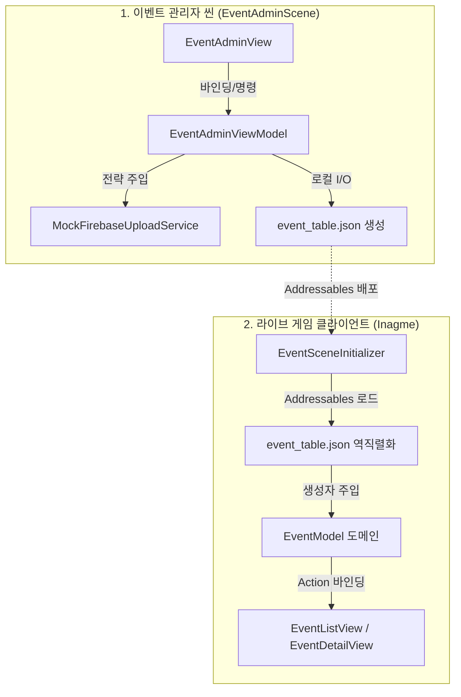
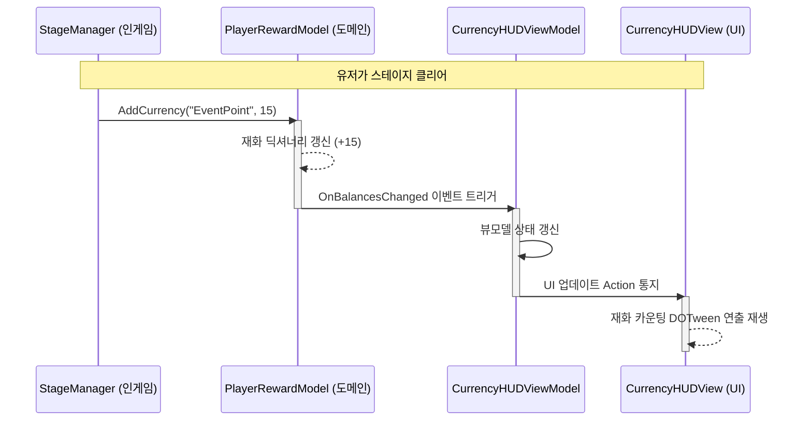

# 🎮 BePex Unity Client

> Unity Clean Code & Design Patterns 기반의 확장 가능한 퀘스트(이벤트) 센터 시스템 및 관리자 프로그램

본 프로젝트는 이벤트 데이터의 생성, 추적, 보상 지급, 저장에 이르는 전체 라이프사이클을 단방향 데이터 흐름(MVVM)과 순수 의존성 주입(Pure DI)으로 제어하는 클라이언트 시스템입니다.

---

## 📑 목차

1. [프로젝트 정보](#1-프로젝트-정보)
2. [시스템 설명](#2-시스템-설명)
3. [새로운 기능 추가 방법 (확장 가이드)](#3-새로운-기능-추가-방법-확장-가이드)
4. [설계 설명](#4-설계-설명)
5. [작업 시간 (Time Log)](#5-작업-시간-time-log)
6. [AI 사용 내역 (AI Usage)](#6-ai-사용-내역-ai-usage)
7. [성능 최적화 포인트](#7-성능-최적화-포인트)

---

## 1. 프로젝트 정보

- Unity 버전: 6.3.16f1
- 로컬 세이브 연동: 어드민과 인게임 앱은 persistentDataPath를 공유하여 로컬 파일 기반으로 데이터를 상호 교환합니다.
- 어드레서블 및 서버 연동: 인게임 씬 기동 시 실시간 어드레서블 런타임 핫패치(UpdateAddressableCatalogAsync)가 연동되어 있으며, 어드민의 서버 배포(Firebase REST API) 파이프라인을 통해 원격 테이블 갱신 및 라이브 패치에 즉각 대응 가능하도록 인프라가 구축되어 있습니다.

### 🏃‍♂️ 씬(Scene) 실행 방법

#### ① 인게임 이벤트 센터 (Inagme.unity)
- Assets/_Game/Scenes/Inagme.unity 씬을 열고 Play(▶) 합니다.
- 💡 테스트/디버그 모드: [System]/EventSceneInitializer 오브젝트 인스펙터에서 m_useDebugMode를 체크하면 우측 하단에 치트 조작 패널(EventDebugView)이 활성화됩니다.

#### ② 이벤트 관리자 어드민 (EventAdminScene.unity)
- Assets/_Game/Scenes/EventAdminScene.unity 씬을 열고 Play(▶) 합니다.
- ⚠️ 주의사항: 좌측 [+ 신규 이벤트]에서 이벤트를 추가/편집 후 [로컬 파일 저장]을 누르면 로컬 JSON이 즉시 변경됩니다. [Firebase 서버 배포] 클릭 시 비동기 업로드(1.5초 지연 시뮬레이션)가 진행됩니다.

### 📦 Standalone 분리 빌드 (빌드 자동화)
Unity 에디터 상단 메뉴 BePex > Build 를 통해 씬별 단독 실행형 바이너리를 자동 빌드할 수 있습니다.
- Build Admin Standalone: Builds/Admin/ 폴더에 어드민 바이너리 생성
- Build Ingame Standalone: 어드레서블 자산 최신화 후 Builds/Ingame/ 폴더에 인게임 바이너리 생성
- Build All Standalone: 어드민 ➔ 인게임 순차 자동 빌드
> (※ 빌드 파이프라인에서 Company Name과 Product Name을 강제 동기화하여 세이브 파일 공유를 보장합니다.)

---

## 2. 시스템 설명

### 2.1 전체 시스템 구조 (UML)
전역 싱글톤을 배제하고, 각 씬의 Composition Root(Initializer)가 씬 로드 시 도메인, 뷰모델, 서비스를 한 번만 생성자 주입하여 결합도를 낮춥니다.

### 2.2 주요 도메인 클래스 매핑
과제 평가 규정(readme_rules.md)에서 요구하는 핵심 책임 요소들의 구현 명세입니다.

| 요구 명칭 | 실제 구현 클래스 | 주요 역할 및 설명 |
| :--- | :--- | :--- |
| EventManager | EventModel / EventListViewModel | 전체 이벤트 데이터의 로드, 진행 상태, 조건 체크 및 보상 수령 여부를 제어하고 상태 변화를 전파하는 핵심 중재 도메인 모델. |
| EventTracker | BaseQuestCondition 계열 | 각 이벤트/퀘스트 인스턴스의 달성 조건을 관리하고 현재 진행 수치를 검증 및 추적하는 전략 구현체. |
| RewardSystem | QuestRewardFactory / PlayerRewardModel | 보상 획득 여부를 감지하고, 팩토리를 통해 보상 인스턴스를 생성한 후 플레이어 재화 및 자산 데이터를 적립시키는 시스템. |
| AttendanceEvent | AttendanceQuestCondition | 24시간 일일 날짜 대조 가드 로직을 내장하여 일일 1회만 카운트가 제한되도록 추적하는 출석 체크 전담 조건 전략. |
| MissionEvent | StandardQuestCondition | 적 처치(KillCount), 스테이지 클리어(StageClear) 등 행동 값의 단순 누적 및 한계치 비교를 담당하는 공용 범용 조건 전략. |
| EventPointSystem | PlayerRewardModel (AddCurrency) | 스테이지 클리어 및 광고 시청 등을 통해 이벤트 포인트를 획득하고 관리하는 재화 상태 시스템. |
| SaveSystem | JsonSaveSystem / CachedSaveSystem | 플레이어 진행 상황 및 획득한 보상 재화 DTO를 로컬 파일 디스크 I/O 기반으로 영속 저장 및 복구하는 입출력 장치. |
| EventUI | EventListView / CurrencyHUDView 등 | View-ViewModel 데이터 바인딩(Action 이벤트 및 Command 호출)을 따르는 MVVM 기반 UI 뷰 컴포넌트군. |

### 2.3 아키텍처 계층 상세
- 🗄️ Model / DTO: EventModel, PlayerRewardModel(POCO), EventTableSO 등 비즈니스 로직.
- 🧠 ViewModel: EventListViewModel, CurrencyHUDViewModel 등 상태 중개자.
- 🖥️ View: EventListView, RewardPopupView 등 UI 렌더링.
- 🎯 Condition 전략: BaseQuestCondition 등 목표 달성 판정 객체.
- 🎁 Reward 전략: BaseQuestReward 등 보상 지급 실행 객체.
- 🔌 Interfaces: ISaveSystem, IFirebaseUploadService 등 규격 인터페이스.
- 🏗️ Infrastructure: EventSceneInitializer(DI 진입점), CachedSaveSystem.
- 🛠️ Factories: QuestConditionFactory 등 리플렉션/폴백 매핑 지원 유틸리티.
- ✍️ Editor Tool: EventExtensionWindow 등 개발 데이터 자동 생성 윈도우.

---

## 3. 새로운 기능 추가 방법 (확장 가이드)

본 시스템은 데이터 기반(Data-driven) 팩토리 폴백 구조를 채택하여, C# 코딩 없이 에디터 조작만으로 확장이 가능합니다.

### 3.1 새로운 이벤트(조건) 타입 추가
> 에디터 툴 위치: 상단 메뉴 Tools > BePex > 이벤트 시스템 확장 도구

- ✅ [권장] 단순 카운트 조건 (C# 코딩 ❌)
  1. 확장 대상 이벤트 타입 선택 ➔ 영문 식별자(예: LoginCount) 입력.
  2. "C# 파일 추가 생성" 토글 OFF 후 실행.
  3. 데이터 에셋만 자동 등록되며, 런타임에 범용 StandardQuestCondition으로 자동 매핑됩니다.
- ⚠️ 특수 가드 로직 필요 시 (C# 코딩 ⭕️)
  1. 위 설정에서 "C# 파일 추가 생성" 토글 ON 후 실행.
  2. 자동 생성된 스크립트의 CanAddProgress를 오버라이드하여 특수 로직을 구현합니다.

### 3.2 새로운 보상 타입 추가
- ✅ [권장] 단순 가산형 재화 추가 (C# 코딩 ❌)
  1. 확장 대상 보상 타입 선택 ➔ 영문 식별자(예: Ruby) 입력.
  2. "C# 파일 추가 생성" 토글 OFF 후 실행.
  3. 범용 GeneralQuestReward를 매핑하여 지갑 딕셔너리에 안전하게 가산됩니다.
- ⚠️ 특수 연출 / 우편함 연동 필요 시 (C# 코딩 ⭕️)
  1. 토글 ON으로 C# 파일 생성 후 Grant() 메서드 내부에 외부 API 호출을 작성합니다.

### 3.3 리액티브 이벤트 포인트 획득 흐름 (UML)
인게임 컨트롤러에서 도메인 모델에 포인트를 적립하면, MVVM 아키텍처를 통해 UI까지 데이터가 단방향으로 자동 전파됩니다.

(예시: StageManager에 주입된 PlayerRewardModel 인스턴스의 AddCurrency 단 1줄만 호출하면 위 흐름이 자동으로 수행됩니다.)

---

## 4. 설계 설명

### 4.1 설계 시 고려 사항
- 확장성 및 OCP (개방 폐쇄 원칙)
  - 이벤트 조건 및 보상이 계속 추가되어도 기존 비즈니스 코드가 수정되지 않도록 리플렉션 팩토리(QuestConditionFactory)를 설계했습니다.
  - 특수 로직이 필요 없는 수치 비교는 에셋 생성만으로 폴백 매핑(StandardQuestCondition)되도록 최적화했습니다.
- 관심사 분리 (SoC) 및 MVVM 준수
  - UI 뷰(MonoBehaviour)는 데이터 바인딩 및 클릭 전달만 수행하며, 비즈니스 도메인과 세이브 I/O는 순수 C# POCO 클래스로 격리했습니다.
- 서버 확장성 고려 (DIP)
  - ISaveSystem과 IFirebaseUploadService 인터페이스를 통해 실제 백엔드 연동(Firebase 등)으로 손쉽게 교체 가능한 지연 결합 구조입니다.

### 4.2 현재 구조의 한계와 개선 방향
- 씬 전환 시 의존성 전달의 한계 (Pure DI)
  - 각 씬의 SceneInitializer가 독자적 DI 루트 역할을 하여, 싱글톤 배제 시 씬 간 인스턴스 전파에 제약이 발생합니다.
  - 개선 방향: 추후 VContainer를 도입하여 ProjectLifetimeScope 상에 영구 인스턴스를 바인딩하고 자동 주입을 구성할 예정입니다.

---

## 5. 작업 시간 (Time Log)

- 총 작업 시간 : 48.5시간
  - 12.0시간 : 설계 및 문서화
  - 15.5시간 : 이벤트 시스템 로직 및 OCP 팩토리 구현
  - 10.0시간 : UI 및 MVVM 연동
  - 11.0시간 : 비동기 세이브 처리 및 Newtonsoft.Json 호환성 보완 검증

---

## 6. AI 사용 내역 (AI Usage)

- 사용한 AI 도구: Antigravity Agent (Opus 4.8 / Gemini / Claude 계열)
- 사용 범위:
  - PlayerRewardModel의 Newtonsoft.Json 직렬화 전환 및 [OnDeserialized] 하위 호환 마이그레이션 적용.
  - CachedSaveSystem의 Awaitable Detached State 크래시 방지를 위한 락(Lock) 구조 아이디어.
  - 팩토리 폴백(Fallback) 라우팅 로직 정교화 및 보일러플레이트 축소.
- 검증 방법:
  - 제안된 로직은 Unity Test Runner의 EditMode(24종) 및 PlayMode(6종) 총 30종의 단위/통합 시나리오를 통과시켜 무결성을 100% 교차 검증했습니다.

---

## 7. 성능 최적화 포인트

- Zero-Allocation (GC 억제 최적화)
  - 리스트를 신규 할당하던 구조를 폐기하고 버퍼(IReadOnlyList)를 재사용하는 GetActiveEventsNonAlloc 구조를 도입하여 런타임 GC 할당을 차단했습니다.
  - 잦은 DateTime.TryParse 파싱 부하를 DTO 내부 Nullable 캐싱 필드로 대체했습니다.
- 비동기 동시성 예외 해결 (Unity 6 Awaitable)
  - Awaitable의 단 1회 await 제약을 우회하기 위해 HashSet 기반 락 관리 및 슬롯 폴링 방식을 도입하여 세이브 안정성을 확보했습니다.
  - async void 진입점에 try-catch(OperationCanceledException)을 래핑해 씬 전환 시 누수를 차단했습니다.
- 원격 예외 회복력 (Decorator Pattern)
  - 데코레이터 패턴으로 RetrySaveSystemDecorator를 조립해 저장 실패 시 지수 백오프(Exponential Backoff) 재시도를 수행합니다.