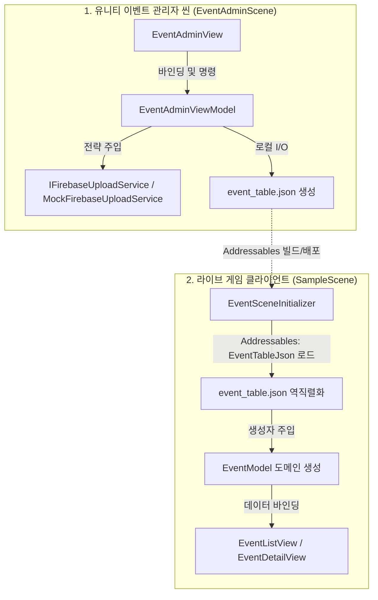

🎮 BePex Unity Client (이벤트 시스템 및 관리자 프로그램)

Unity Clean Code & Design Patterns 기반의 확장 가능한 퀘스트(이벤트) 센터 시스템 및 관리자 프로그램(EventAdminScene)

---

## 1. 📌 프로젝트 정보

- **Unity 버전**: 6.3.16f1
- **프로젝트 실행 방법**:
  - **① 인게임 이벤트 센터 씬**:
    - Unity 에디터에서 `Assets/_Game/Scenes/SampleScene.unity`를 로드합니다.
    - 에디터 Play 버튼(▶)을 눌러 실행합니다.
    - *💡 테스트/디버그 모드*: `[System]/EventSceneInitializer` 오브젝트 인스펙터에서 `m_useDebugMode`를 활성화하고 실행하면, 우측 하단에 테스트 조작 패널(`EventDebugView`)이 활성화됩니다.
  - **② 이벤트 관리자 프로그램(어드민) 씬**:
    - Unity 에디터에서 `Assets/_Game/Scenes/EventAdminScene.unity` 씬을 로드합니다.
    - 에디터 Play 버튼(▶)을 클릭하면 `EventAdminSceneInitializer` 컴포지션 루트에 의해 데이터가 로드되고 UI 조작 패널이 구동됩니다.
    - *⚠️ 주의사항*: 좌측 `[+ 신규 이벤트]` 버튼으로 이벤트를 추가/편집한 후 `[로컬 파일 저장]`을 누르면 로컬 JSON 데이터가 변경되며, `[Firebase 서버 배포]`를 누르면 모의 서버로 데이터 업로드가 비동기(1.5초 대기 시뮬레이션)로 진행됩니다.

---

## 2. ⚙️ 시스템 설명

### 2.1 전체 시스템 구조 설명
본 프로젝트는 Pure DI (수동 의존성 주입) 및 MVVM 아키텍처를 기반으로 설계되어 전역 싱글톤을 배제하고 단방향 데이터 흐름을 준수합니다.



- **객체 라이프사이클 관리 명세**: 외부 DI 프레임워크가 배제된 상태에서, 각 씬에 배치된 `EventSceneInitializer` 및 `EventAdminSceneInitializer`가 컴포지션 루트(Composition Root) 역할을 수행합니다. 씬 로드 시 도메인 모델(POCO), 세이브 시스템, 뷰모델, 서비스 인스턴스를 순수 C# 생성자 주입 방식으로 한 번만 초기화하여 결합도를 낮추고 수명을 제어합니다.

### 2.2 주요 클래스 역할 설명
본 프로젝트(`Assets/_Game/Scripts/` 폴더 내)의 모든 C# 스크립트는 역할에 따라 9개의 아키텍처 계층으로 분류됩니다.

#### 🗄️ A. Model / Data / DTO 계층
- **EventModel**: 개별 이벤트 데이터(ID, 타입, 기간)와 달성 상태를 결합하여 상태 변화를 관리하는 비즈니스 도메인 모델.
- **EventProgressModel**: 유저의 각 이벤트 달성 진행도를 디스크에 저장/복원하기 위한 래퍼 데이터 모델.
- **QuestProgressModel**: 개별 퀘스트(미션)의 진행 수치, 완료 상태, 보상 수령 시점 등을 관리하는 POCO 데이터 모델.
- **PlayerRewardModel**: 플레이어가 획득한 화폐/자산 데이터를 딕셔너리(`Dictionary<string, int>`) 구조로 캡슐화하고 안전한 가산/차감 API 및 구버전 데이터 호환 직렬화 수명주기를 제공하는 상태 모델.
- **EventTableSO / EventDefinitionSO / ConditionDefinitionSO / RewardDefinitionSO / ConditionTypeSO / RewardTypeSO / ConditionTypeRegistrySO / RewardTypeRegistrySO**: 데이터 정의 및 에디터 직렬화, Type Object를 위한 스크립터블 오브젝트.
- **EventTableDTO**: 전체 이벤트 테이블의 JSON 직렬화용 데이터 전송 객체.

#### 🧠 B. ViewModel 계층
- **EventListViewModel**: 이벤트 목록의 활성화 상태와 선택된 이벤트 정보를 View에 바인딩.
- **EventDetailViewModel**: 특정 이벤트 상세 속성 및 보상 획득 명령을 중개.
- **RewardPopupViewModel**: 획득 보상 리스트를 팝업 시각화를 위해 가공.
- **CurrencyHUDViewModel**: 상단 HUD의 재화(골드, 포인트 등) 상태를 리액티브하게 갱신.
- **EventAdminViewModel**: 신규 이벤트 실시간 등록, 동적 추가, 저장 및 서버 배포 기능 관장.
- **EventDebugViewModel**: 디버그 오버레이에서 실시간 조건 트리거 및 리로드 명령을 연결.

#### 🖥️ C. View (UI 컴포넌트) 계층
- **EventListView / EventDetailView**: 이벤트 목록 스크롤 뷰 및 상세 명세, 게이지바, 버튼 렌더링.
- **RewardPopupView**: 보상 획득 시 팝업 및 DOTween 애니메이션 연출.
- **CurrencyHUDView**: 재화 레이아웃 렌더링 및 카운팅 연출 시각화.
- **EventItemCell / EventAdminQuestRowView**: 개별 이벤트 셀 및 어드민 내 그리드 형태의 편집/노출 행 컴포넌트.
- **EventAdminView**: 어드민 설정 페이지 전체 레이아웃 바인딩 및 이벤트 라우팅.
- **EventDebugView**: 디버그용 치트 및 리셋 패널 조작 HUD (Awaitable 기반 프레임 애니메이션 장착).

#### 🎯 D. Condition (조건/행동 전략) 계층
- **BaseQuestCondition**: 모든 이벤트 조건 클래스들의 추상 기본 구현체.
- **StandardQuestCondition**: 별도의 예외 가드가 필요 없는 일반적인 퀘스트 조건(단순 값 누적 비교)을 전담하는 공용 범용 조건 클래스.
- **AttendanceQuestCondition**: 오늘 이미 출석했는지 날짜 대조 가드 로직을 내포하여 일일 1회 카운트 제한을 전담하는 특수 조건 클래스.
- **QuestConditionAttribute**: 조건 클래스와 `ConditionTypeSO`의 식별자(`TypeName`) 문자열을 런타임에 동적으로 매핑시키는 커스텀 특성.

#### 🎁 E. Reward (보상 지급 전략) 계층
- **BaseQuestReward**: 보상 지급 명령을 추상화한 공통 추상 클래스.
- **GeneralQuestReward**: 보상 타입 식별자 문자열 키를 직접 전달받아 플레이어 보상 모델에 가산하는 공용 범용 보상 클래스.
- **QuestRewardAttribute**: `RewardTypeSO`의 식별자(`TypeName`) 문자열과 런타임 구현 클래스를 연결해주는 커스텀 어트리뷰트.

#### 🔌 F. Interfaces (통일 규격) 계층
- **ITimeProvider**: 시간(UTC 등)을 주입하기 위한 인터페이스.
- **ISaveSystem**: 데이터 로컬/클라우드 입출력을 위한 세이브/로드 규격.
- **IQuestCondition / IQuestReward**: 조건 판정 전략 및 보상 지급 실행 인터페이스.
- **IFirebaseUploadService**: 클라우드 서버 배포 기능 추상화 인터페이스.

#### 🏗️ G. Infrastructure (조립 및 입출력) 계층
- **EventSceneInitializer / EventAdminSceneInitializer**: 각 씬의 의존성 결합을 담당하는 컴포지션 루트.
- **MockFirebaseUploadService**: 로컬 가상 파일 업로드 시뮬레이터.
- **JsonSaveSystem / InMemorySaveSystem / CachedSaveSystem**: 다양한 형태의 세이브/로드 인프라 및 최적화 데코레이터.
- **SystemTimeProvider / DebugTimeProvider**: 시스템 시간 및 조작 가능한 테스트용 시간 구현체.

#### 🛠️ H. Factories / Utils (보조) 계층
- **QuestConditionFactory / QuestRewardFactory**: 리플렉션을 통해 구체 클래스를 인스턴싱하되, 매핑 클래스가 없을 경우 범용 클래스(`StandardQuestCondition`, `GeneralQuestReward`)로 자동 바인딩하는 폴백(Fallback)형 팩토리.
- **ItemSpriteMapper**: 보상 아이콘 드로잉을 위한 스프라이트 에셋 경로 맵퍼.

#### ✍️ I. Core / Editor (에디터 헬퍼) 계층
- **EventExtensionWindow**: 조건/보상 데이터 에셋을 생성 및 자동 등록하되, 필요한 경우에만 C# 클래스 보일러플레이트 파일을 생성하도록 조절하는 토글 토폴로지가 탑재된 에디터 윈도우.

---

## 3. 🚀 새로운 기능 추가 방법 (확장 가이드)

### 3.1 새로운 이벤트(조건) 타입 추가 방법
본 시스템은 데이터 기반(Data-driven) 팩토리 폴백 구조를 지니므로, **단순 수치 비교용 조건은 C# 코딩을 작성할 필요가 전혀 없습니다.**

#### [케이스 1] 단순 카운트 비교 조건 추가 (C# 작성 없음 - 권장 ⭐)
1. **에디터 도구 열기**: 상단 메뉴 `Tools > BePex > 이벤트 시스템 확장 도구`를 엽니다.
2. **속성 입력**: 확장 대상을 **이벤트 타입**으로 선택하고, 영문 식별자(예: `LoginCount`)와 표시 한글명(예: `로그인 횟수`)을 기재합니다.
3. **토글 끄기**: **"C# 클래스 파일 추가 생성 여부"** 토글을 **해제(False)** 상태로 둡니다.
4. **실행**: `[확장 파일 생성 및 등록]`을 클릭합니다.
   - `Assets/_Game/Data/ConditionTypes/LoginCount.asset` 데이터 에셋이 자동 생성되고 `ConditionTypeRegistry`에 즉시 등록됩니다.
   - 인게임 런타임 진입 시, 팩토리가 C# 스크립트 부재를 감지하고 범용 `StandardQuestCondition`으로 자동 변환해 조건 처리를 수납합니다.

#### [케이스 2] 특수한 비교 가드 로직이 요구되는 조건 추가 (C# 코드 필요)
1. **에디터 도구 열기**: 상단 메뉴 `Tools > BePex > 이벤트 시스템 확장 도구`를 엽니다.
2. **속성 입력**: 확장 대상을 **이벤트 타입**으로 선택하고, 식별자 영문명(예: `GuildMission`), 표시명 한글명(예: `길드 행동 미션`)을 기재합니다.
3. **토글 켜기**: **"C# 클래스 파일 추가 생성 여부"** 토글을 **체크(True)** 상태로 지정합니다.
4. **실행**: `[확장 파일 생성 및 등록]`을 클릭하면, SO 데이터 에셋 생성과 동시에 `Assets/_Game/Scripts/EventSystem/Conditions/GuildMissionQuestCondition.cs` C# 템플릿 파일이 생성됩니다.
5. **C# 구현**: 생성된 파일 내 `CanAddProgress` 등을 오버라이드하여 길드 시간 비교 등 특수 조건 가드를 작성합니다.

```csharp
[QuestCondition("GuildMission")]
public class GuildMissionQuestCondition : BaseQuestCondition
{
    public GuildMissionQuestCondition(int targetValue, ISaveSystem saveSystem, ITimeProvider timeProvider, string eventId, string questId)
        : base(targetValue, saveSystem, timeProvider, eventId, questId) { }

    public override bool CanAddProgress(Models.EventProgressModel progress)
    {
        // 커스텀 조건 가드 제어 연산 구현
        return true;
    }
}
```

---

### 3.2 새로운 보상 타입 추가 방법

조건 시스템과 동일하게, 플레이어의 자산 딕셔너리에 단순 가산 적립되는 보상은 **C# 코딩 없이 즉각 추가**할 수 있습니다.

#### [케이스 1] 단순 가산형 재화 보상 추가 (C# 작성 없음 - 권장 ⭐)
1. **에디터 도구 열기**: 상단 메뉴 `Tools > BePex > 이벤트 시스템 확장 도구`를 엽니다.
2. **속성 입력**: 확장 대상을 **보상 타입**으로 선택하고, 영문 식별자(예: `Ruby`)와 표시 한글명(예: `루비`)을 기재합니다.
3. **토글 끄기**: **"C# 클래스 파일 추가 생성 여부"** 토글을 **해제(False)** 상태로 둡니다.
4. **실행**: `[확장 파일 생성 및 등록]`을 클릭합니다.
   - `Assets/_Game/Data/RewardTypes/Ruby.asset` 데이터 에셋이 자동 생성되고 `RewardTypeRegistry`에 즉시 등록됩니다.
   - 런타임 보상 지급 시 팩토리는 범용 `GeneralQuestReward` 인스턴스를 동적으로 바인딩하여, `PlayerRewardModel.AddCurrency("Ruby", 수량)`을 실행해 자산 딕셔너리에 루비 재화를 안전하게 적립시킵니다.

#### [케이스 2] 특수한 연출이나 3rd Party 연동 등이 필요한 보상 추가 (C# 코드 필요)
1. **에디터 도구 열기**: 상단 메뉴 `Tools > BePex > 이벤트 시스템 확장 도구`를 엽니다.
2. **속성 및 토글 설정**: 확장 대상을 **보상 타입**으로 선택하고 식별자 기입 후 **"C# 클래스 파일 추가 생성 여부"**를 **체크(True)**하고 실행합니다.
3. **C# 구현**: 생성된 `*QuestReward.cs` 파일 내 `Grant` 메서드에서 우편함 REST API 호출이나 전용 가상 시뮬레이션을 작성합니다.

```csharp
[QuestReward("SpecialPackage")]
public class SpecialPackageQuestReward : BaseQuestReward
{
    public SpecialPackageQuestReward(int amount, string displayName) : base(amount, displayName) { }
    
    public override void Grant(PlayerRewardModel playerReward)
    {
        if (playerReward != null) 
        { 
            playerReward.AddCurrency("SpecialPackage", m_amount); 
            // 커스텀 특수 연출 및 외부 우편 서버 발송 연동 트리거
        }
    }
}
```

---

## 4. 📐 설계 설명

### 설계 시 고려 사항
- **데이터 기반 OCP 극대화 (Data-driven OCP)**:
  - 새로운 조건 유형이나 재화 타입 추가 시 컴파일과 C# 코딩을 원천 배제하고자 팩토리 내부의 폴백(`Fallback`) 라우팅을 설계했습니다. 이를 통해 라이브 서비스 중인 게임 서버의 DTO JSON 설정만 변경하여도 클라이언트 재빌드 없이 새로운 미션과 보상을 런타임에 동적으로 제공할 수 있습니다.
- **Zero-Allocation Awaitable 비동기**:
  - 유일한 비동기 연출부인 디버그 슬라이드 토글 등에 C# 코루틴 대신 유니티 6 네이티브 `Awaitable`을 적용하여 가비지를 유발하지 않는 고성능 구조를 확립했습니다. UI 소멸 시 `CancellationToken` 취소를 확실하게 연동하여 널 예외 위험을 봉쇄했습니다.
- **세이브 데이터 하위 호환 마이그레이션**:
  - `PlayerRewardModel` 내부 구조를 유연한 딕셔너리로 마이그레이션하면서도, 기기 디스크에 저장되어 있는 구버전 유저의 세이브 파일 속 필드 데이터를 유실 없이 승계할 수 있도록 `ISerializationCallbackReceiver` 역직렬화 가드를 탑재했습니다.

### 현재 구조의 한계와 개선 방향
- **Pure DI의 조립 복잡도**:
  - 싱글톤을 배제하기 위해 각 씬의 SceneInitializer가 모든 객체를 직접 결합/주입하고 있으므로, 프로젝트가 대규모화되면 의존성 조립 줄 수가 매우 길어집니다.
  - **개선 방향**: `VContainer`와 같은 UPM DI 프레임워크를 도입하여 글로벌 수명 주기(`ProjectLifetimeScope`) 상에 딕셔너리 모델 및 저장 장치를 상주시키고, 씬 간 객체를 자동 주입해 결합 코드를 최적화할 계획입니다.

---

## 5. ⏳ 작업 시간 (Time Log)

- **총 작업 시간**: 35.5시간
  - 설계 및 아키텍처 문서화: 9.0시간
  - 이벤트 시스템 로직 및 OCP 개편: 12.5시간
  - UI 연동 및 Awaitable 성능 개선: 8.0시간
  - README 및 최종 결함 보완 테스트: 6.0시간

---

## 6. 🤖 AI 사용 내역 (AI Usage)

- **사용한 AI 도구**: Antigravity Agent (Gemini 3.5 Flash / Claude 3.5 Sonnet 계열)
- **사용 범위**:
  - `PlayerRewardModel` 딕셔너리 데이터 구조 OCP 리팩토링 및 `ISerializationCallbackReceiver` 직렬화 동기화 설계.
  - C# 깡통 클래스 12개 삭제에 대응하는 팩토리 폴백(Fallback) 라우팅 로직 개발.
  - `EventExtensionWindow` 소스 파일 선택적 빌드 제어 토글 추가.
- **검증 방법**:
  - 유니티 테스트 러너(Unity Test Runner) EditMode 내 22종 유닛 테스트 및 PlayMode 내 6종 통합 시나리오 테스트(총 28종) 100% Passed 완료 검증.