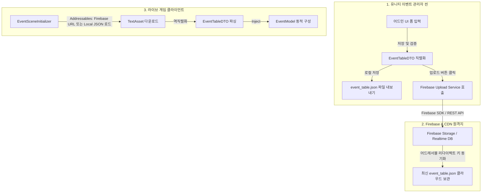

# 이벤트 시스템 관리자 프로그램(Unity Admin Scene) 및 Firebase 연동 설계서

> **작성자**: 윤승종  
> **작성일**: 2026-06-14  
> **상태**: 사용자 검토 대기 (유니티 인게임 씬 및 Firebase 업로드 연동 반영)  

---

## 1. 개요 및 배경
운영자가 유니티 에셋 폴더 내의 파일들을 수동으로 편집 및 생성하지 않고 이벤트를 실시간으로 제어할 수 있도록, 유니티 클라이언트 프로젝트 내부에 독립적인 **이벤트 관리자 씬(EventAdminScene)**을 구축합니다.
또한, 작성된 이벤트를 로컬 JSON 파일로 저장할 수 있을 뿐만 아니라, **Firebase 서버에 즉시 배포(업로드)**하여 라이브 클라이언트가 최신 이벤트 정보를 실시간으로 다운로드할 수 있는 원격 파이프라인을 설계합니다.

---

## 2. 변경되는 아키텍처 및 데이터 흐름

### 2.1 전체 데이터 파이프라인 (Firebase & Addressables)


---

## 3. 유니티 어드민 씬 UI 및 구조 설계

### 3.1 UI 화면 레이아웃 (Unity UI / UGUI)
- **좌측 패널 (Scroll View)**: 등록된 이벤트 목록 카드가 노출됩니다. 하단에 `[+ 신규 이벤트]` 버튼이 배치됩니다.
- **우측 패널 (Vertical Layout)**: 선택된 이벤트의 세부 폼을 기입합니다.
  - **기본 메타데이터**: Event ID (InputField), Title (InputField), Description (InputField), Start/End Date (InputField).
  - **달성 조건**: Condition Type (Dropdown - KillCount, StageClear, Attendance), Target Value (InputField).
  - **보상 리스트**: 동적 Row 리스트 (Reward Type Dropdown, Amount InputField, DisplayName InputField, Icon Path InputField).
- **하단 제어 바 (Horizontal Layout)**:
  - `[로컬 파일 저장]`: 로컬 `Assets/_Game/Data/event_table.json` 파일에 즉시 작성 및 내보내기.
  - `[Firebase 서버 배포]`: Firebase REST API 또는 SDK 브릿지를 호출하여 클라우드에 JSON 데이터 업로드.

### 3.2 MVVM 아키텍처 클래스 설계
- **`EventAdminView` (MonoBehaviour)**: UGUI 컴포넌트 참조 및 데이터 바인딩(입력 값 전달 및 리스트 갱신 관찰) 수행.
- **`EventAdminViewModel` (Pure C#)**: 화면 상의 상태(State) 및 저장/업로드 명령(Command) 제공.
- **`IFirebaseUploadService` (Interface)**: Firebase로의 파일 업로드 처리를 추상화하여 구현체 교체가 용이하도록 설계.

---

## 4. 데이터 인터페이스 설계

### 4.1 Firebase 업로드 서비스 인터페이스 (`IFirebaseUploadService.cs`)
```csharp
using UnityEngine;

namespace BePex.EventSystem.Interfaces
{
    /// <summary>
    /// [기능]: 직렬화된 이벤트 JSON 데이터를 Firebase 서버로 안전하게 업로드하는 통신 인터페이스.
    /// [작성자]: 윤승종
    /// </summary>
    public interface IFirebaseUploadService
    {
        /// <summary>
        /// [기능]: 이벤트 DTO 데이터를 JSON 문자열로 변환하여 Firebase Storage 또는 Realtime DB에 비동기로 업로드합니다.
        /// [작성자]: 윤승종
        /// </summary>
        Awaitable<bool> UploadEventTableAsync(BePex.EventSystem.DTOs.EventTableDTO tableDTO);
    }
}
```

### 4.2 Firebase 업로드 Mock 서비스 구현 (`MockFirebaseUploadService.cs`)
Firebase SDK가 부재하거나 테스트 환경인 상황에서 로그를 출력하고 업로드 과정을 시뮬레이션할 수 있도록 모사 클래스를 설계합니다.

```csharp
using UnityEngine;
using BePex.EventSystem.Interfaces;
using BePex.EventSystem.DTOs;

namespace BePex.EventSystem.Infrastructure
{
    /// <summary>
    /// [기능]: 테스트 환경 및 로컬 개발용 Firebase 업로드 모사(Mock) 구현 클래스.
    /// [작성자]: 윤승종
    /// </summary>
    public class MockFirebaseUploadService : IFirebaseUploadService
    {
        /// <summary>
        /// [기능]: JSON 데이터를 인코딩하여 Firebase 가상 엔드포인트 업로드 로그를 출력합니다.
        /// [작성자]: 윤승종
        /// </summary>
        public async Awaitable<bool> UploadEventTableAsync(EventTableDTO tableDTO)
        {
            Debug.Log("[MockFirebaseUploadService] Firebase 업로드 요청 수락됨.");
            
            // JSON 변환 시뮬레이션
            string jsonText = JsonUtility.ToJson(tableDTO, true);
            Debug.Log($"[MockFirebaseUploadService] 변환된 JSON 파일 본문:\n{jsonText}");

            // 네트워크 대기 비동기 지연 모사
            await Awaitable.WaitForSecondsAsync(1.5f);

            Debug.Log("[MockFirebaseUploadService] Firebase 서버 업로드 완료! (가상 성공)");
            return true;
        }
    }
}
```

---

## 5. 어드레서블 및 빌드 자동화 제어

1. **로컬 파일 연계**:
   - `Assets/_Game/Data/event_table.json`에 툴이 직접 데이터를 쓰고 덮어씌웁니다.
2. **에디터 윈도우 스크립트 (Editor Window Build Trigger) 확장 제안**:
   - 운영자가 유니티 에디터 내에서 조작할 때, 파일이 업데이트되면 자동으로 Addressables 빌드 스크립트(`AddressableAssetSettings.BuildPlayerContent()`)를 가동하도록 돕는 유틸리티 제공.

---

## 6. 검증 계획 (Verification Plan)

### 6.1 유닛 테스트 추가 명세
- **Firebase Mock Upload 검증**: `IFirebaseUploadService` 구현체를 모의 주입받은 `EventAdminViewModel`이 업로드 버튼 이벤트 시 정상적으로 비동기 통신을 완료하는지 검증하는 테스트 추가.
- **DTO 무결성 검증**: UI 입력을 통해 변형된 폼 데이터가 DTO 객체로 손실 없이 매핑되는지 테스트.

### 6.2 수동 검증
- 유니티 에디터에서 `EventAdminScene`을 열어 신규 이벤트를 추가한 뒤 `[로컬 파일 저장]`을 누르고, 생성된 `event_table.json`을 검사합니다.
- `[Firebase 서버 배포]` 버튼을 클릭하여 유니티 디버그 콘솔창에 변환된 JSON 본문 및 가상 업로드 완료 로그가 `[MockFirebaseUploadService]` 태그와 함께 명확히 출력되는지 검증합니다.
