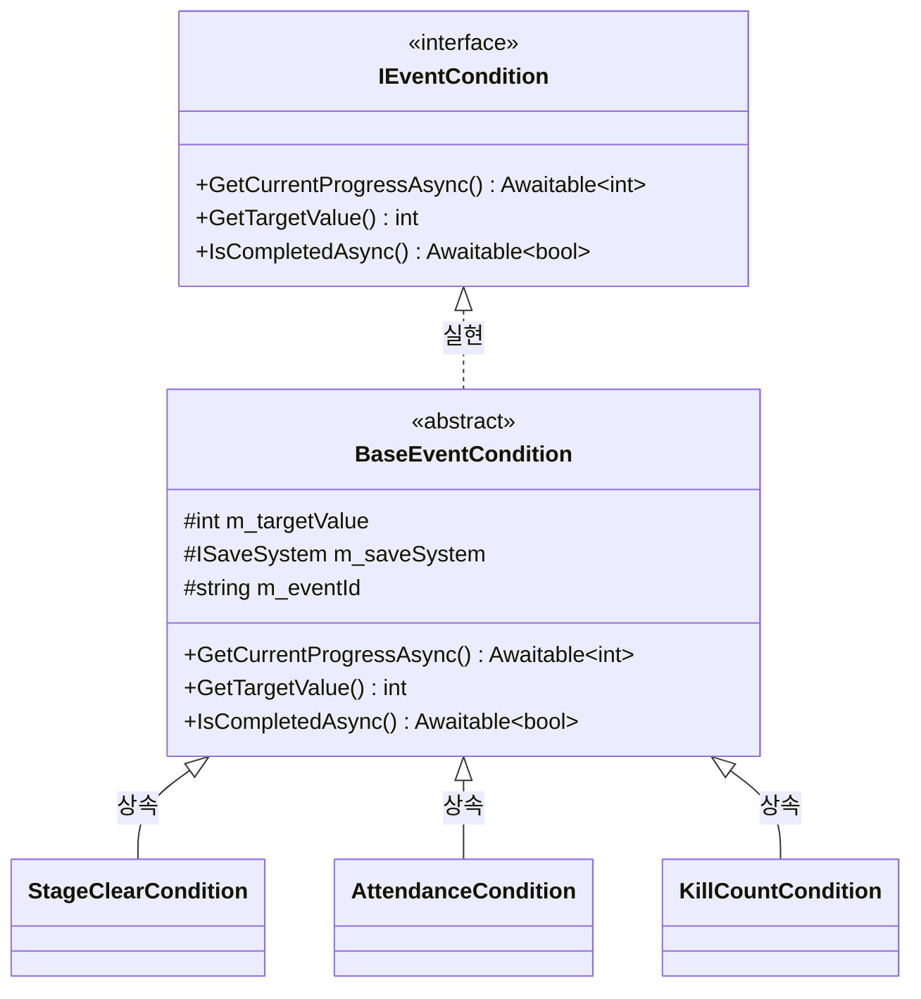

# 이벤트 시스템 리팩토링 상세 설계서 (Event System Refactoring Spec)

> **작성자**: 윤승종  
> **작성일**: 2026-06-14  
> **목적**: BePex Unity Client 이벤트 시스템 모듈 내의 중복 로직을 제거하고, 상용급 코드 수준에 부합하도록 가독성, 네이밍 규칙, XML 주석 표준 및 Unity 안정성 수칙을 전면 보완하기 위한 설계 사양 명세.

---

## 1. 아키텍처 개요 및 리팩토링 목표

본 리팩토링은 기존 이벤트 시스템의 핵심 비즈니스 로직과 데이터 바인딩 흐름을 깨뜨리지 않고, 아래 3대 요소를 충족하는 구조 개선을 목표로 합니다.

1. **중복 코드 제거 (DRY - Don't Repeat Yourself)**:
   - 다수의 조건 전략 클래스(`IEventCondition` 구현체)와 보상 전략 클래스(`IEventReward` 구현체)에 산재한 반복 필드 및 보일러플레이트 메서드를 공통 추상 부모 클래스로 묶어 코드 단순화.
2. **코딩 표준 및 주석 완성 (Consistency & Documentation)**:
   - 클래스 및 누락된 메서드(예: 프라이빗 이벤트 핸들러, 유니티 라이프사이클 함수 등) 전체에 표준 XML 헤더 주석 적재.
   - 인라인 익명 람다식을 명시적인 `func_` 접두사를 가지는 메서드로 추출하여 디버깅 용이성 개선.
3. **유니티 안정성 수칙 (Strict Unity Safety)**:
   - `UnityEngine.Object` 파생 객체에 대한 널 조건부 연산자(`?.`, `??`) 오용 검출 및 일관성 확보.
   - 데이터 가비지(GC) 생성을 방지하기 위한 루프 최적화(`foreach` 대신 `for` 사용 보증).

---

## 2. 세부 설계 사양

### 2.1 조건(Condition) 및 보상(Reward) 상속 계층 설계

#### 2.1.1 조건(Condition) 상속 구조
기존의 `AttendanceCondition`, `KillCountCondition`, `StageClearCondition`은 공통 멤버 변수(`m_targetValue`, `m_saveSystem`, `m_eventId`)와 진행도 조회 흐름이 100% 일치합니다. 이를 `BaseEventCondition` 추상 클래스로 이관합니다.



- **`BaseEventCondition`**:
  - `ISaveSystem`과 `eventId`, `targetValue`를 멤버 변수로 보관 및 초기화 생성자 제공.
  - `GetCurrentProgressAsync()`, `GetTargetValue()`, `IsCompletedAsync()` 기본 비동기/동기 로직 구현 (가상 메서드 `virtual` 처리로 하위 클래스에서 필요시 커스텀 오버라이드 지원).

#### 2.1.2 보상(Reward) 상속 구조
기존의 `PointReward`, `ExpReward`, `TicketReward`에 분산 선언되어 있는 `m_amount` 및 `m_displayName`을 `BaseEventReward` 추상 클래스로 통일합니다.

- **`BaseEventReward`**:
  - `amount`, `displayName`에 대한 생성자 초기화 및 Getter 기능(`GetRewardName()`, `GetRewardAmount()`)을 공통 구현.
  - `Grant(PlayerRewardModel playerReward)` 메서드는 순수 가상/추상 메서드(`abstract`)로 남겨두어, 파생 클래스에서 고유의 자산 차감/가산 비즈니스 로직을 구현하도록 강제.

---

### 2.2 주석 및 포맷 규격화 (Coding Standard)

#### 2.2.1 프라이빗 메서드 XML 주석 복원
아래의 클래스들에서 누락되었던 모든 프라이빗/이벤트 핸들러 메서드에 XML 주석 헤더를 추가합니다.
- `EventListViewModel.cs` -> `HandleEventProgressChanged`, `HandleEventRewardClaimed`
- `EventDetailViewModel.cs` -> `HandleProgressChanged`, `HandleRewardClaimed`
- `EventDetailView.cs` -> `OnDestroy`, `func_OnDetailUpdatedWrapper`
- `RewardPopupView.cs` -> `OnDestroy`
- `EventItemCell.cs` -> `LoadSpriteAsync`
- `EventListView.cs` -> `OnDestroy`
- `ConditionFactory.cs` & `RewardFactory.cs` -> `BuildRegistry`

#### 2.2.2 람다 리스너의 정식 메서드화
`EventItemCell.cs`에서 람다를 사용해 리스너를 바인딩하는 구조를 명확히 구조화된 UI 콜백 함수로 전환합니다.
- 변경 전:
  ```csharp
  m_selectButton.onClick.AddListener(() => { ... });
  ```
- 변경 후:
  ```csharp
  m_selectButton.onClick.AddListener(func_OnSelectCellTriggered);
  ```

#### 2.2.3 POCO 모델 초기화 일관성 확보
`SeasonPassModel.cs` 내에 명시적인 기본 생성자를 도입하고, 리스트 형식의 멤버들을 해당 생성자 내부에서 생성하여 데이터 유실 및 직렬화 시점의 NullReferenceException 오류를 원천 차단합니다.

---

### 2.3 안정성 검증 규칙 (Unity Safety)
1. **Fake Null Check 방지**: 
   - `UnityEngine.Object`를 상속받은 타입에는 널 조건부 연산자(`?.`, `??`)를 일절 사용하지 않도록 소스 코드를 전수 필터링합니다. (예: `m_claimButton?.onClick` -> `if (m_claimButton != null)`)
2. **GC 최적화**:
   - `Update` 등 빈번히 일어날 수 있는 루프 내에서 가비지가 누적되는 `foreach` 구문이 완전히 제거되었는지 확인하고, 모든 리스트 렌더링 순회를 인덱스 기반 `for` 루프로 통일합니다.

---

## 3. 검증 계획 (Verification Plan)

### 3.1 자동 테스트
- 기존 에디터 테스트 코드(`EventSystemTests.cs`)를 구동하여 리팩토링 후에도 기존 기획 데이터 파싱, 조건 판정, 보상 지급 처리가 아무런 회귀 버그(Regression Bug) 없이 완벽히 동작하는지 검증합니다.

### 3.2 수동 테스트
- 데모용 인게임 이벤트 리스트 뷰 및 이벤트 상세 뷰에서 클릭 동작, 진척도 갱신, 보상 획득 연출 팝업이 정상적으로 출력되는지 눈으로 확인합니다.
- 관리자 툴(Admin Tool) 씬에서 CRUD를 조작하고 로컬 파일 입출력 및 Firebase 연동 정상 응답을 검수합니다.
